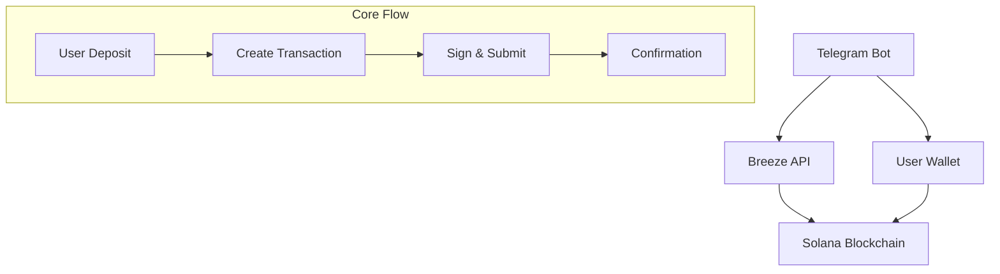

# Functionality


<video
  controls
  className="w-full aspect-video rounded-lg shadow-lg center"
  src="/Integration-Guide/videos/tg-bot-using-breeze-api.mp4"
  poster="/Integration-Guide/videos/banner-api.jpeg"
>
  Your browser does not support the video tag.
</video>

# Test it yourself

If the bot will be running on our hardware, then you will be able to test it yourself.
You can find it under **@breeze_integration_bot** handle or under [this link](https://t.me/breeze_integration_bot). 

# Code Location

<Card
      title="GitHub Repo"
      icon={<svg xmlns="http://www.w3.org/2000/svg" width="28" height="28" viewBox="0 0 24 24" fill="none" stroke="#bc07c9" stroke-width="2" stroke-linecap="round" stroke-linejoin="round" class="lucide lucide-bot-icon lucide-bot"><path d="M12 8V4H8"/><rect width="16" height="12" x="4" y="8" rx="2"/><path d="M2 14h2"/><path d="M20 14h2"/><path d="M15 13v2"/><path d="M9 13v2"/></svg>}
      href="https://github.com/anagrambuild/breeze-integration-examples/tree/master/telegram-bot-using-breeze-api"
    >
    Find out the github repository with the full code  
</Card>

# Explination

## Overview

The Breeze Protocol integration enables:
- **Simplified User Experience**: No manual fund account initialization required
- **Real-time Balance Tracking**: Live updates from the Breeze API
- **Multi-Asset Support**: USDC, USDT, PYUSD, and USDS compatibility
- **Seamless Transactions**: Direct deposit and withdrawal flow

<Info>
The Breeze API handles user fund account creation automatically, eliminating the need for manual initialization flows.
</Info>

## Architecture



{/* ```mermaid
graph TB
    subgraph "User Flow"
        A[User Initiates Deposit] --> B[Deposit Funds]
        B --> C[View Transaction Logs]
        C --> D[Monitor Deposited Amount]
        D --> E[Check Balance & APY]
        E --> F[Decide to Withdraw]
        F --> G[Withdraw Funds]
        G --> H[Transaction Complete]
    end

    subgraph "Integration Flow"
        I[User Deposit Request] --> J[Call /ixs API Endpoint]
        J --> K[Get Deposit Transaction]
        K --> L[User Signs Transaction]
        L --> M[Submit Transaction]
        M --> N[Check User Stats]
        N --> O[Call Stats Endpoint]
        O --> P[Calculate APY]
        P --> Q[Get Current Balance]
        Q --> R[Display to User]
        R --> S[User Withdraw Request]
        S --> T[Call /single ix API Endpoint]
        T --> U[Get Withdraw Transaction]
        U --> V[User Signs Transaction]
        V --> W[Submit Transaction]
        W --> X[Update Balance]
    end
``` */}

## API Configuration

### Environment Variables

```typescript
const BREEZE_API_KEY = process.env.BREEZE_API_KEY!;
const BREEZE_FUND_ID = process.env.BREEZE_FUND_ID!;
const BREEZE_PROGRAM_ID = process.env.BREEZE_PROGRAM_ID!;
const SOLANA_RPC_URL = process.env.SOLANA_RPC_URL || 'https://api.mainnet-beta.solana.com';
```

### Base URL
```
http://localhost:8080
```

<Warning>
Ensure your API key is kept secure and never exposed in client-side code.
</Warning>

## Core API Endpoints

### 1. Deposit Transaction

Creates a deposit transaction for transferring stablecoins to Breeze.

```typescript
POST /deposit/tx
```

**Request Body:**
```json
{
  "params": {
    "fund_id": "string",
    "amount": number,
    "all": boolean,
    "user_key": "string",
    "payer_key": null
  }
}
```

**Response:**
```json
{
  "success": true,
  "result": "base64_encoded_transaction"
}
```

### 2. Withdraw Transaction

Creates a withdrawal transaction for extracting funds from Breeze.

```typescript
POST /withdraw/tx
```

**Request Body:**
```json
{
  "params": {
    "fund_id": "string",
    "shares": number,
    "all": boolean,
    "user_key": "string",
    "payer_key": null
  }
}
```

### 3. User Current Value

Fetches the current value of user's position in Breeze.

```typescript
GET /user/{user_pubkey}/current_value
```

**Response:**
```json
{
  "success": true,
  "result": [
    {
      "base_asset": "USDC",
      "position": {
        "fund_id": "string",
        "base_asset_value": 3000000.0,
        "percent_of_fund": 100.0,
        "total_fund_value": 3000000.0
      }
    }
  ]
}
```

## Implementation Guide

### Token Configuration

```typescript
const TOKEN_DECIMALS = {
    USDC: 6,
    USDT: 6,
    PYUSD: 6,
    USDS: 6,
    SOL: 9
};

const TOKEN_MINTS = {
    USDC: 'EPjFWdd5AufqSSqeM2qN1xzybapC8G4wEGGkZwyTDt1v',
    USDT: 'Es9vMFrzaCERmJfrF4H2FYD4KCoNkY7xgxACzBn3wqHg',
    PYUSD: 'CXk2AMBfi3TwaEL2468s6zP8xq9NxTXjp9gjMgzeUynM',
    USDS: '2b1kV6DkPAnxd5ixfnxCpjxmKwqjjaYmCZfHsFu24GXo'
};
```

### Core Integration Class

```typescript
class BreezeIntegration {
    private async getUserCurrentValue(userPublicKey: string): Promise<number> {
        try {
            const response = await fetch(`http://localhost:8080/user/${userPublicKey}/current_value`, {
                method: 'GET',
                headers: {
                    "Content-Type": "application/json",
                    "api-key": BREEZE_API_KEY
                }
            });

            const data = await response.json();
            
            if (!data.success || data.error) {
                console.error('Error fetching user value:', data.error);
                return 0;
            }

            // Sum up all base asset values across different assets
            let totalValue = 0;
            for (const position of data.result) {
                const tokenSymbol = position.base_asset;
                const valueInTokenUnits = position.position.base_asset_value;
                
                const humanValue = this.convertFromTokenAmount(
                    BigInt(Math.floor(valueInTokenUnits)), 
                    tokenSymbol
                );
                totalValue += humanValue;
            }

            return totalValue;
        } catch (error) {
            console.error('Error fetching user current value:', error);
            return 0;
        }
    }
}
```

### Deposit Flow Implementation

```typescript
private async processDeposit(chatId: number, percentage?: number, customAmount?: number) {
    const userData = this.users.get(chatId)!;
    const balances = await this.getBalances(userData.publicKey!);

    let tokenAmount: bigint;
    let humanAmount: number;
    let isAll = false;

    // Calculate amounts based on user selection
    if (percentage === 100) {
        tokenAmount = balances.usdc.raw;
        humanAmount = balances.usdc.human;
        isAll = true;
    } else if (percentage === 50) {
        tokenAmount = balances.usdc.raw / BigInt(2);
        humanAmount = this.convertFromTokenAmount(tokenAmount, 'USDC');
    } else if (customAmount) {
        humanAmount = customAmount;
        tokenAmount = this.convertToTokenAmount(customAmount, 'USDC');
    }

    // Create deposit transaction
    const requestBody = {
        "params": {
            "fund_id": BREEZE_FUND_ID,
            "amount": Number(tokenAmount),
            "all": isAll,
            "user_key": userData.publicKey,
            "payer_key": null
        }
    };

    const response = await fetch('http://localhost:8080/deposit/tx', {
        method: 'POST',
        headers: {
            "Content-Type": "application/json",
            "api-key": BREEZE_API_KEY
        },
        body: JSON.stringify(requestBody)
    });

    const data = await response.json();
    
    if (data.success && data.result) {
        // Handle transaction signing and submission
        await this.handleTransaction(chatId, data.result, 'deposit', humanAmount);
    }
}
```

### Withdraw Flow Implementation

```typescript
private async processWithdraw(chatId: number, percentage?: number, customAmount?: number) {
    const userData = this.users.get(chatId)!;
    const breezeBalance = await this.getUserCurrentValue(userData.publicKey!);

    let humanAmount: number;
    let isAll = false;

    if (percentage === 100) {
        humanAmount = breezeBalance;
        isAll = true;
    } else if (percentage === 50) {
        humanAmount = breezeBalance * 0.5;
    } else if (customAmount) {
        humanAmount = customAmount;
    }

    const tokenAmount = this.convertToTokenAmount(humanAmount, 'USDC');

    const requestBody = {
        "params": {
            "fund_id": BREEZE_FUND_ID,
            "shares": Number(tokenAmount),
            "all": isAll,
            "user_key": userData.publicKey,
            "payer_key": null
        }
    };

    const response = await fetch('http://localhost:8080/withdraw/tx', {
        method: 'POST',
        headers: {
            "Content-Type": "application/json",
            "api-key": BREEZE_API_KEY
        },
        body: JSON.stringify(requestBody)
    });

    const data = await response.json();
    
    if (data.success && data.result) {
        await this.handleTransaction(chatId, data.result, 'withdraw', humanAmount);
    }
}
```

## Transaction Handling

### Transaction Signing and Submission

```typescript
private async confirmTransaction(chatId: number) {
    const userData = this.users.get(chatId)!;
    const pendingTx = userData.pendingTransaction;

    if (!pendingTx?.serializedTx) {
        throw new Error('No pending transaction found');
    }

    // Deserialize and sign the transaction
    const transaction = VersionedTransaction.deserialize(
        Buffer.from(pendingTx.serializedTx, 'base64')
    );
    
    transaction.sign([userData.keypair!]);

    // Submit to Solana network
    const signature = await this.connection.sendTransaction(transaction);
    
    // Wait for confirmation
    const confirmation = await this.connection.confirmTransaction(signature, 'confirmed');
    
    if (confirmation.value.err) {
        throw new Error('Transaction failed');
    }

    return signature;
}
```

## Error Handling

### API Error Responses

```typescript
interface BreezeApiResponse {
    success: boolean;
    result?: string;
    error?: string;
    [key: string]: any;
}

// Handle API errors
if (!data.success || data.error) {
    console.error('Breeze API Error:', data.error);
    throw new Error(data.error || 'Unknown API error');
}
```

### Common Error Scenarios

<AccordionGroup>
<Accordion title="Insufficient Balance">
When a user tries to deposit more than their available balance:

```typescript
if (tokenAmount <= 0) {
    await this.bot.sendMessage(chatId, '❌ Insufficient USDC balance!');
    return;
}
```
</Accordion>

<Accordion title="Network Errors">
Handle network connectivity issues:

```typescript
try {
    const response = await fetch(apiUrl);
    // ... process response
} catch (error) {
    console.error('Network error:', error);
    await this.bot.sendMessage(chatId, '❌ Network error. Please try again.');
}
```
</Accordion>

<Accordion title="Transaction Failures">
Handle blockchain transaction failures:

```typescript
const confirmation = await this.connection.confirmTransaction(signature, 'confirmed');

if (confirmation.value.err) {
    await this.bot.sendMessage(chatId, '❌ Transaction failed!');
    return;
}
```
</Accordion>
</AccordionGroup>

## Best Practices

### 1. Token Amount Conversion

Always use precise decimal handling for token amounts:

```typescript
private convertToTokenAmount(humanAmount: number, tokenSymbol: string): bigint {
    const decimals = TOKEN_DECIMALS[tokenSymbol as keyof typeof TOKEN_DECIMALS] || 6;
    const amountStr = humanAmount.toFixed(decimals);
    const [integerPart, decimalPart = ''] = amountStr.split('.');
    const paddedDecimal = decimalPart.padEnd(decimals, '0').slice(0, decimals);
    const fullAmountStr = integerPart + paddedDecimal;
    return BigInt(fullAmountStr);
}
```

### 2. Real-time Balance Updates

Fetch current values before each operation:

```typescript
const currentBalance = await this.getUserCurrentValue(userPublicKey);
```

### 3. User Experience

- Show loading states during API calls
- Provide clear error messages
- Implement transaction confirmation UI
- Display real-time balance updates

### 4. Security Considerations

- Validate all user inputs
- Use environment variables for sensitive data
- Implement rate limiting
- Log transactions for auditing

## Monitoring and Logging

### Transaction Logging

```typescript
private logTransactionDetails(serializedTx: string, context: string) {
    console.log(`\n=== ${context} TRANSACTION DEBUG ===`);
    console.log('Serialized TX:', serializedTx.substring(0, 100) + '...');
    
    try {
        const transaction = VersionedTransaction.deserialize(
            Buffer.from(serializedTx, 'base64')
        );
        
        console.log('Transaction details:', {
            version: transaction.version,
            messageKeys: transaction.message.staticAccountKeys.length,
            instructions: transaction.message.compiledInstructions.length
        });
    } catch (error) {
        console.error('Failed to deserialize transaction:', error);
    }
}
```

### Performance Monitoring

Track API response times and success rates:

```typescript
const startTime = Date.now();
const response = await fetch(apiUrl);
const responseTime = Date.now() - startTime;

console.log(`API call took ${responseTime}ms`);
```

## Deployment Notes

### Environment Setup

```bash
# Required environment variables
BREEZE_API_KEY=your_api_key_here
BREEZE_FUND_ID=your_fund_id_here
BREEZE_PROGRAM_ID=your_program_id_here
SOLANA_RPC_URL=https://api.mainnet-beta.solana.com
BOT_TOKEN=your_telegram_bot_token
```

## Troubleshooting

<AccordionGroup>
<Accordion title="API Connection Issues">
- Verify API key is correct
- Check network connectivity
- Ensure base URL is accessible
- Review API rate limits
</Accordion>

<Accordion title="Transaction Failures">
- Check user has sufficient SOL for fees
- Verify token account exists
- Ensure transaction isn't expired
- Check RPC connection
</Accordion>

<Accordion title="Balance Discrepancies">
- Refresh balance after operations
- Check for pending transactions
- Verify decimal conversion accuracy
- Review fund calculation logic
</Accordion>
</AccordionGroup>

---

<Note>
This integration assumes the Breeze API is running locally on port 8080. Adjust the base URL for production deployments.
</Note>

For additional support or questions, consult the Breeze Protocol documentation or reach out to the development team.