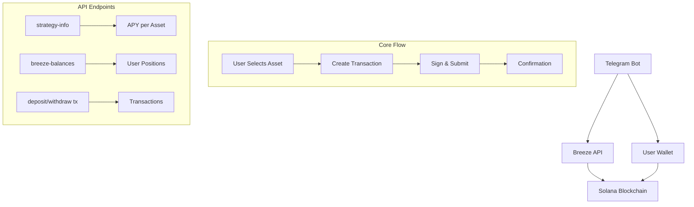

# Functionality


<video
  controls
  className="w-full aspect-video rounded-lg shadow-lg center"
  src="/Integration-Guide/videos/tg-bot-using-breeze-api.mp4"
  poster="/Integration-Guide/videos/banner-api.jpeg"
>
  Your browser does not support the video tag.
</video>

# Test it yourself

If the bot will be running on our hardware, then you will be able to test it yourself.
You can find it under **@breeze_integration_bot** handle or under [this link](https://t.me/breeze_integration_bot).

# Code Location

<Card
      title="GitHub Repo"
      icon={<svg xmlns="http://www.w3.org/2000/svg" width="28" height="28" viewBox="0 0 24 24" fill="none" stroke="#bc07c9" stroke-width="2" stroke-linecap="round" stroke-linejoin="round" class="lucide lucide-bot-icon lucide-bot"><path d="M12 8V4H8"/><rect width="16" height="12" x="4" y="8" rx="2"/><path d="M2 14h2"/><path d="M20 14h2"/><path d="M15 13v2"/><path d="M9 13v2"/></svg>}
      href="https://github.com/anagrambuild/breeze-integration-examples/tree/master/telegram-bot-using-breeze-api"
    >
    Find out the github repository with the full code
</Card>

# Explanation
## Overview

The Breeze Protocol integration enables:
- **Simplified User Experience**: No manual fund account initialization required
- **Real-time Balance Tracking**: Live updates from the Breeze API
- **Multi-Asset Support**: USDC, USDT, USDS, JupSOL, JLP, mSOL, JitoSOL, and SOL
- **Strategy-Based Yield**: Use strategy ID with per-asset APY tracking
- **Seamless Transactions**: Direct deposit and withdrawal flow

<Info>
The Breeze API handles user fund account creation automatically, eliminating the need for manual initialization flows. The new strategy-based approach allows depositing multiple assets into a single strategy with individual APY tracking per asset.
</Info>

## Architecture



## API Configuration

### Environment Variables

```typescript
const BOT_TOKEN = process.env.TELEGRAM_BOT_TOKEN || process.env.BOT_TOKEN!;
const SOLANA_RPC_URL = process.env.SOLANA_RPC_URL || 'https://api.mainnet-beta.solana.com';
const BREEZE_API_KEY = process.env.BREEZE_API_KEY!;
const STRATEGY_ID = process.env.STRATEGY_ID!;
```

### Base URL
```
https://api.breeze.baby/
```

<Warning>
Ensure your API key is kept secure and never exposed in client-side code.
</Warning>

## Core API Endpoints

### 1. Strategy Info

Fetches strategy details including APY per asset.

```typescript
GET /strategy-info/{strategy_id}
```

**Response:**
```json
{
  "strategy_id": "43620ba3-354c-456b-aa3c-5bf7fa46a6d4",
  "strategy_name": "try-breeze-all-assets",
  "assets": ["EPjFWdd5AufqSSqeM2qN1xzybapC8G4wEGGkZwyTDt1v", "..."],
  "apy": 4.10,
  "apy_per_asset": {
    "EPjFWdd5AufqSSqeM2qN1xzybapC8G4wEGGkZwyTDt1v": 5.25,
    "Es9vMFrzaCERmJfrF4H2FYD4KCoNkY11McCe8BenwNYB": 4.80,
    "jupSoLaHXQiZZTSfEWMTRRgpnyFm8f6sZdosWBjx93v": 7.20
  }
}
```

### 2. Breeze Balances

Fetches user's positions within a strategy.

```typescript
GET /breeze-balances/{user_pubkey}?strategy_id={strategy_id}
```

**Response:**
```json
{
  "data": [
    {
      "strategy_name": "try-breeze-all-assets",
      "strategy_id": "43620ba3-354c-456b-aa3c-5bf7fa46a6d4",
      "fund_id": "fund_123",
      "token_address": "EPjFWdd5AufqSSqeM2qN1xzybapC8G4wEGGkZwyTDt1v",
      "token_symbol": "USDC",
      "token_name": "USD Coin",
      "decimals": 6,
      "total_position_value": 1000000000,
      "total_deposited_value": 950000000,
      "yield_earned": 50000000,
      "apy": 5.25,
      "last_updated": "2024-01-20T14:45:00Z"
    }
  ],
  "meta": {
    "page": 1,
    "per_page": 10,
    "total": 1,
    "total_pages": 1,
    "has_more": false
  }
}
```

### 3. Deposit Transaction

Creates a deposit transaction using strategy ID and base asset (mint).

```typescript
POST /deposit/tx
```

**Request Body:**
```json
{
  "params": {
    "strategy_id": "43620ba3-354c-456b-aa3c-5bf7fa46a6d4",
    "base_asset": "EPjFWdd5AufqSSqeM2qN1xzybapC8G4wEGGkZwyTDt1v",
    "amount": 1000000,
    "all": false,
    "user_key": "user_public_key",
    "payer_key": "user_public_key"
  }
}
```

**Response (Success):**
```typescript
// Returns serialized transaction as string
"base64_encoded_transaction_string"
```

**Response (Error):**
```json
{
  "message": "Error description"
}
```

### 4. Withdraw Transaction

Creates a withdrawal transaction using strategy ID and base asset.

```typescript
POST /withdraw/tx
```

**Request Body:**
```json
{
  "params": {
    "strategy_id": "43620ba3-354c-456b-aa3c-5bf7fa46a6d4",
    "base_asset": "EPjFWdd5AufqSSqeM2qN1xzybapC8G4wEGGkZwyTDt1v",
    "amount": 1000000,
    "all": false,
    "user_key": "user_public_key",
    "payer_key": "user_public_key"
  }
}
```

## Implementation Guide

### Asset Configuration

```typescript
// Asset configuration interface
interface AssetConfig {
    symbol: string;
    mint: string;
    decimals: number;
}

// Available assets for the strategy
const AVAILABLE_ASSETS: AssetConfig[] = [
    { symbol: 'USDC', mint: 'EPjFWdd5AufqSSqeM2qN1xzybapC8G4wEGGkZwyTDt1v', decimals: 6 },
    { symbol: 'USDT', mint: 'Es9vMFrzaCERmJfrF4H2FYD4KCoNkY11McCe8BenwNYB', decimals: 6 },
    { symbol: 'USDS', mint: 'USDSwr9ApdHk5bvJKMjzff41FfuX8bSxdKcR81vTwcA', decimals: 6 },
    { symbol: 'JupSOL', mint: 'jupSoLaHXQiZZTSfEWMTRRgpnyFm8f6sZdosWBjx93v', decimals: 9 },
    { symbol: 'JLP', mint: '27G8MtK7VtTcCHkpASjSDdkWWYfoqT6ggEuKidVJidD4', decimals: 6 },
    { symbol: 'mSOL', mint: 'mSoLzYCxHdYgdzU16g5QSh3i5K3z3KZK7ytfqcJm7So', decimals: 9 },
    { symbol: 'JitoSOL', mint: 'J1toso1uCk3RLmjorhTtrVwY9HJ7X8V9yYac6Y7kGCPn', decimals: 9 },
    { symbol: 'SOL', mint: 'So11111111111111111111111111111111111111112', decimals: 9 },
];

// Create lookup maps for quick access
const TOKEN_DECIMALS: Record<string, number> = {};
const TOKEN_MINTS: Record<string, string> = {};
const MINT_TO_SYMBOL: Record<string, string> = {};
for (const asset of AVAILABLE_ASSETS) {
    TOKEN_DECIMALS[asset.symbol] = asset.decimals;
    TOKEN_MINTS[asset.symbol] = asset.mint;
    MINT_TO_SYMBOL[asset.mint] = asset.symbol;
}
```

### API Response Interfaces

```typescript
// API response types
type BreezeApiResponseUpdated =
    | string // serialized transaction
    | { message: string }; // error

// Breeze Balances API response
interface BreezeBalance {
    strategy_name: string;
    strategy_id: string;
    fund_id: string;
    token_address: string;
    token_symbol: string;
    token_name: string;
    decimals: number;
    total_position_value: number;  // in token units
    total_deposited_value: number; // in token units
    yield_earned: number;          // in token units
    apy: number;
    last_updated: string;
}

interface BreezeBalancesResponse {
    data: BreezeBalance[];
    meta: {
        page: number;
        per_page: number;
        total: number;
        total_pages: number;
        has_more: boolean;
    };
}

// Strategy Info API response
interface StrategyInfo {
    strategy_id: string;
    strategy_name: string;
    assets: string[];
    apy: number;
    apy_per_asset: Record<string, number>; // mint -> APY
}

// User data with selected asset
interface UserData {
    keypair?: Keypair;
    publicKey?: string;
    currentMenu?: string;
    selectedAsset?: AssetConfig;
    pendingTransaction?: {
        serializedTx: string;
        type: 'deposit' | 'withdraw';
        amount?: number;
        asset?: string;
    };
}
```

### Core Integration Class

```typescript
class BreezeBot {
    private bot: TelegramBot;
    private connection: Connection;
    private users: Map<number, UserData> = new Map();

    constructor() {
        this.bot = new TelegramBot(BOT_TOKEN, { polling: true });
        this.connection = new Connection(SOLANA_RPC_URL);
        this.setupHandlers();
    }

    // Fetch strategy info with APY per asset
    private async getStrategyInfo(): Promise<StrategyInfo | null> {
        try {
            const response = await fetch(`https://api.breeze.baby/strategy-info/${STRATEGY_ID}`, {
                method: 'GET',
                headers: {
                    "Content-Type": "application/json",
                    "x-api-key": BREEZE_API_KEY
                }
            });

            if (!response.ok) {
                console.error('Error fetching strategy info: HTTP', response.status);
                return null;
            }

            return await response.json() as StrategyInfo;
        } catch (error) {
            console.error('Error fetching strategy info:', error);
            return null;
        }
    }

    // Fetch breeze balances with strategy_id
    private async getBreezeBalances(userPublicKey: string): Promise<BreezeBalancesResponse | null> {
        try {
            const response = await fetch(
                `https://api.breeze.baby/breeze-balances/${userPublicKey}?strategy_id=${STRATEGY_ID}`,
                {
                    method: 'GET',
                    headers: {
                        "Content-Type": "application/json",
                        "x-api-key": BREEZE_API_KEY
                    }
                }
            );

            if (!response.ok) {
                console.error('Error fetching breeze balances: HTTP', response.status);
                return null;
            }

            return await response.json() as BreezeBalancesResponse;
        } catch (error) {
            console.error('Error fetching breeze balances:', error);
            return null;
        }
    }

    // Precise BigInt token amount conversion
    private convertToTokenAmount(humanAmount: number, tokenSymbol: string): bigint {
        const decimals = TOKEN_DECIMALS[tokenSymbol] || 6;
        const amountStr = humanAmount.toFixed(decimals);
        const [integerPart, decimalPart = ''] = amountStr.split('.');
        const paddedDecimal = decimalPart.padEnd(decimals, '0').slice(0, decimals);
        const fullAmountStr = integerPart + paddedDecimal;
        return BigInt(fullAmountStr);
    }

    private convertFromTokenAmount(tokenAmount: bigint, tokenSymbol: string): number {
        const decimals = TOKEN_DECIMALS[tokenSymbol] || 6;
        const divisor = BigInt(10 ** decimals);
        const integerPart = Number(tokenAmount / divisor);
        const remainder = tokenAmount % divisor;
        const decimalPart = Number(remainder) / Number(divisor);
        return integerPart + decimalPart;
    }

    // Get total portfolio value across all assets
    private async getUserCurrentValue(userPublicKey: string): Promise<number> {
        try {
            const balanceData = await this.getBreezeBalances(userPublicKey);
            if (!balanceData) return 0;

            let totalPortfolioValue = 0;
            for (const balance of balanceData.data) {
                // Convert from token units to human-readable
                const humanValue = this.convertFromTokenAmount(
                    BigInt(Math.floor(balance.total_position_value)),
                    balance.token_symbol
                );
                totalPortfolioValue += humanValue;
            }
            return totalPortfolioValue;
        } catch (error) {
            console.error('Error fetching user current value:', error);
            return 0;
        }
    }

    // Get user's balance for a specific asset in Breeze
    private async getUserAssetBalance(userPublicKey: string, mint: string): Promise<number> {
        try {
            const balanceData = await this.getBreezeBalances(userPublicKey);
            if (!balanceData) return 0;

            for (const balance of balanceData.data) {
                if (balance.token_address === mint) {
                    return this.convertFromTokenAmount(
                        BigInt(Math.floor(balance.total_position_value)),
                        balance.token_symbol
                    );
                }
            }
            return 0;
        } catch (error) {
            console.error('Error fetching asset balance:', error);
            return 0;
        }
    }
}
```

### Deposit Flow with Multi-Asset Support

```typescript
private async showDepositInterface(chatId: number) {
    const strategyInfo = await this.getStrategyInfo();
    const userData = this.users.get(chatId)!;
    const balances = await this.getBalances(userData.publicKey!);

    let message = '📥 **Deposit to Breeze** 📥\n\n' +
        'Select the asset you want to deposit:\n\n';

    // Build keyboard with all available assets and their APY
    const keyboard: TelegramBot.InlineKeyboardButton[][] = [];

    for (const asset of AVAILABLE_ASSETS) {
        const apy = strategyInfo?.apy_per_asset?.[asset.mint] || 0;
        const assetKey = asset.symbol.toLowerCase();
        const balance = balances[assetKey]?.human || 0;

        const buttonText = `${asset.symbol} - ${apy.toFixed(2)}% APY (${balance.toFixed(2)} available)`;
        keyboard.push([{ text: buttonText, callback_data: `deposit_asset_${asset.symbol}` }]);
    }

    keyboard.push([{ text: '🔙 Back', callback_data: 'earn_yield' }]);

    await this.bot.sendMessage(chatId, message, {
        parse_mode: 'Markdown',
        reply_markup: { inline_keyboard: keyboard }
    });
}

// Process deposit with strategy_id + base_asset
private async processDeposit(chatId: number, percentage?: number, customAmount?: number) {
    const userData = this.users.get(chatId)!;
    const selectedAsset = userData.selectedAsset;

    if (!selectedAsset) {
        await this.bot.sendMessage(chatId, '❌ No asset selected. Please select an asset first.');
        return;
    }

    const balances = await this.getBalances(userData.publicKey!);
    const assetKey = selectedAsset.symbol.toLowerCase();
    const assetBalance = balances[assetKey] || { raw: BigInt(0), human: 0 };

    let tokenAmount: bigint;
    let humanAmount: number;
    let isAll = false;

    if (percentage === 100) {
        tokenAmount = assetBalance.raw;
        humanAmount = assetBalance.human;
        isAll = true;
    } else if (percentage === 50) {
        tokenAmount = assetBalance.raw / BigInt(2);
        humanAmount = this.convertFromTokenAmount(tokenAmount, selectedAsset.symbol);
    } else if (customAmount) {
        humanAmount = customAmount;
        tokenAmount = this.convertToTokenAmount(customAmount, selectedAsset.symbol);
    } else {
        return;
    }

    if (tokenAmount <= 0) {
        await this.bot.sendMessage(chatId, `❌ Insufficient ${selectedAsset.symbol} balance!`);
        return;
    }

    try {
        // Use strategy_id + base_asset instead of fund_id
        const requestBody = {
            "params": {
                "strategy_id": STRATEGY_ID,
                "base_asset": selectedAsset.mint,
                "amount": Number(tokenAmount),
                "all": isAll,
                "user_key": userData.publicKey,
                "payer_key": userData.publicKey
            }
        };

        const response = await fetch('https://api.breeze.baby/deposit/tx', {
            method: 'POST',
            headers: {
                "Content-Type": "application/json",
                "x-api-key": BREEZE_API_KEY
            },
            body: JSON.stringify(requestBody)
        });

        const data = await response.json() as BreezeApiResponseUpdated;

        if (typeof data === 'object' && 'message' in data) {
            await this.bot.sendMessage(chatId, `❌ Error: ${data.message}`);
            return;
        }

        userData.pendingTransaction = {
            serializedTx: data,
            type: 'deposit',
            amount: humanAmount,
            asset: selectedAsset.symbol
        };

        await this.showTransactionConfirmation(chatId, 'deposit', humanAmount, selectedAsset.symbol);
    } catch (error) {
        console.error('Deposit error:', error);
        await this.bot.sendMessage(chatId, '❌ Failed to create deposit transaction.');
    }
}
```

### Withdraw Flow with Multi-Asset Support

```typescript
private async showWithdrawInterface(chatId: number) {
    const userData = this.users.get(chatId)!;
    const breezeBalances = await this.getBreezeBalances(userData.publicKey!);
    const strategyInfo = await this.getStrategyInfo();

    let message = '📤 **Withdraw from Breeze** 📤\n\n' +
        'Select the asset you want to withdraw:\n\n';

    const keyboard: TelegramBot.InlineKeyboardButton[][] = [];

    if (breezeBalances && breezeBalances.data.length > 0) {
        for (const balance of breezeBalances.data) {
            if (balance.total_position_value > 0) {
                // Convert from token units to human-readable
                const positionValue = this.convertFromTokenAmount(
                    BigInt(Math.floor(balance.total_position_value)),
                    balance.token_symbol
                );
                const apy = strategyInfo?.apy_per_asset?.[balance.token_address] || balance.apy || 0;
                const buttonText = `${balance.token_symbol} - $${positionValue.toFixed(2)} (${apy.toFixed(2)}% APY)`;
                keyboard.push([{ text: buttonText, callback_data: `withdraw_asset_${balance.token_symbol}` }]);
            }
        }
    }

    if (keyboard.length === 0) {
        message += 'No positions found to withdraw.';
    }

    keyboard.push([{ text: '🔙 Back', callback_data: 'earn_yield' }]);

    await this.bot.sendMessage(chatId, message, {
        parse_mode: 'Markdown',
        reply_markup: { inline_keyboard: keyboard }
    });
}

// Process withdraw with strategy_id + base_asset
private async processWithdraw(chatId: number, percentage?: number, customAmount?: number) {
    const userData = this.users.get(chatId)!;
    const selectedAsset = userData.selectedAsset;

    if (!selectedAsset) {
        await this.bot.sendMessage(chatId, '❌ No asset selected.');
        return;
    }

    const assetBreezeBalance = await this.getUserAssetBalance(userData.publicKey!, selectedAsset.mint);

    let humanAmount: number;
    let isAll = false;

    if (percentage === 100) {
        humanAmount = assetBreezeBalance;
        isAll = true;
    } else if (percentage === 50) {
        humanAmount = assetBreezeBalance * 0.5;
    } else if (customAmount) {
        humanAmount = customAmount;
    } else {
        return;
    }

    if (humanAmount <= 0) {
        await this.bot.sendMessage(chatId, `❌ No ${selectedAsset.symbol} funds available to withdraw!`);
        return;
    }

    const tokenAmount = this.convertToTokenAmount(humanAmount, selectedAsset.symbol);

    try {
        const requestBody = {
            "params": {
                "strategy_id": STRATEGY_ID,
                "base_asset": selectedAsset.mint,
                "amount": Number(tokenAmount),
                "all": isAll,
                "user_key": userData.publicKey,
                "payer_key": userData.publicKey
            }
        };

        const response = await fetch('https://api.breeze.baby/withdraw/tx', {
            method: 'POST',
            headers: {
                "Content-Type": "application/json",
                "x-api-key": BREEZE_API_KEY
            },
            body: JSON.stringify(requestBody)
        });

        const data = await response.json() as BreezeApiResponseUpdated;

        if (typeof data === 'object' && 'message' in data) {
            await this.bot.sendMessage(chatId, `❌ Error: ${data.message}`);
            return;
        }

        userData.pendingTransaction = {
            serializedTx: data,
            type: 'withdraw',
            amount: humanAmount,
            asset: selectedAsset.symbol
        };

        await this.showTransactionConfirmation(chatId, 'withdraw', humanAmount, selectedAsset.symbol);
    } catch (error) {
        console.error('Withdraw error:', error);
        await this.bot.sendMessage(chatId, '❌ Failed to create withdrawal transaction.');
    }
}
```

## Enhanced Features

### Earn Yield Interface with Strategy Info

```typescript
private async showEarnYieldInterface(chatId: number) {
    const userData = this.users.get(chatId)!;
    const publicKey = userData.publicKey!;
    const breezeBalance = await this.getUserCurrentValue(publicKey);
    const strategyInfo = await this.getStrategyInfo();

    let message = '🌊 **Earn Yield with Breeze** 🌊\n\n';
    message += `📊 **Strategy:** ${strategyInfo?.strategy_name || 'Unknown'}\n`;
    message += `📈 **Average APY:** ${(strategyInfo?.apy || 0).toFixed(2)}%\n`;
    message += `🌊 **Your Position:** $${breezeBalance.toFixed(2)}\n\n`;

    message += '**APY by Asset:**\n';
    if (strategyInfo?.apy_per_asset) {
        for (const asset of AVAILABLE_ASSETS) {
            const apy = strategyInfo.apy_per_asset[asset.mint] || 0;
            if (apy > 0) {
                message += `• ${asset.symbol}: ${apy.toFixed(2)}%\n`;
            }
        }
    }

    message += '\n💡 Select an asset to earn passive yield!';

    const keyboard = {
        inline_keyboard: [
            [
                { text: '📥 Deposit', callback_data: 'deposit' },
                { text: '📤 Withdraw', callback_data: 'withdraw' }
            ],
            [{ text: '🔙 Back to Main', callback_data: 'back_to_main' }]
        ]
    };

    await this.bot.sendMessage(chatId, message, {
        parse_mode: 'Markdown',
        reply_markup: keyboard
    });
}
```

### Detailed Balances View

```typescript
private async showDetailedBalances(chatId: number) {
    const userData = this.users.get(chatId)!;
    const publicKey = userData.publicKey!;
    const breezeBalances = await this.getBreezeBalances(publicKey);
    const strategyInfo = await this.getStrategyInfo();

    let totalPortfolioValue = 0;
    let totalYieldEarned = 0;

    if (breezeBalances) {
        for (const balance of breezeBalances.data) {
            const positionValue = this.convertFromTokenAmount(
                BigInt(Math.floor(balance.total_position_value)),
                balance.token_symbol
            );
            const yieldEarned = this.convertFromTokenAmount(
                BigInt(Math.floor(balance.yield_earned)),
                balance.token_symbol
            );
            totalPortfolioValue += positionValue;
            totalYieldEarned += yieldEarned;
        }
    }

    let message = '💳 **Detailed Breeze Balances** 💳\n\n';
    message += `📊 **Strategy:** ${strategyInfo?.strategy_name || 'Unknown'}\n`;
    message += `💰 **Total Portfolio Value:** $${totalPortfolioValue.toFixed(2)}\n`;
    message += `🎯 **Total Yield Earned:** $${totalYieldEarned.toFixed(2)}\n\n`;

    if (!breezeBalances || breezeBalances.data.length === 0) {
        message += 'No positions found in Breeze.';
    } else {
        message += '**Positions by Asset:**\n\n';
        for (const balance of breezeBalances.data) {
            if (balance.total_position_value > 0) {
                const positionValue = this.convertFromTokenAmount(
                    BigInt(Math.floor(balance.total_position_value)),
                    balance.token_symbol
                );
                const depositedValue = this.convertFromTokenAmount(
                    BigInt(Math.floor(balance.total_deposited_value)),
                    balance.token_symbol
                );
                const yieldEarned = this.convertFromTokenAmount(
                    BigInt(Math.floor(balance.yield_earned)),
                    balance.token_symbol
                );
                const apy = strategyInfo?.apy_per_asset?.[balance.token_address] || balance.apy || 0;

                message += `**${balance.token_symbol}**\n`;
                message += `• Position Value: $${positionValue.toFixed(2)}\n`;
                message += `• Deposited: $${depositedValue.toFixed(2)}\n`;
                message += `• Yield Earned: $${yieldEarned.toFixed(2)}\n`;
                message += `• APY: ${apy.toFixed(2)}%\n\n`;
            }
        }
    }

    await this.bot.sendMessage(chatId, message, { parse_mode: 'Markdown' });
}
```

## Transaction Management

### Transaction Signing and Submission

```typescript
private async confirmTransaction(chatId: number) {
    const userData = this.users.get(chatId)!;
    const pendingTx = userData.pendingTransaction;

    if (!pendingTx || !pendingTx.serializedTx) {
        await this.bot.sendMessage(chatId, '❌ No pending transaction found.');
        return;
    }

    try {
        const transaction = VersionedTransaction.deserialize(
            Buffer.from(pendingTx.serializedTx, 'base64')
        );
        transaction.sign([userData.keypair!]);

        const signature = await this.connection.sendTransaction(transaction);

        await this.bot.sendMessage(chatId, '⏳ Transaction sent! Waiting for confirmation...');

        const confirmation = await this.connection.confirmTransaction(signature, 'confirmed');

        if (confirmation.value.err) {
            await this.bot.sendMessage(chatId, '❌ Transaction failed!');
            return;
        }

        const action = pendingTx.type === 'deposit' ? 'deposited to' : 'withdrawn from';
        await this.bot.sendMessage(chatId,
            `🎉 **Successfully ${action} Breeze!**\n\n` +
            `💰 Amount: ${pendingTx.amount?.toFixed(2)} ${pendingTx.asset}\n` +
            `🔗 Transaction: \`${signature}\``,
            { parse_mode: 'Markdown' }
        );

        userData.pendingTransaction = undefined;
    } catch (error) {
        console.error('Transaction error:', error);
        await this.bot.sendMessage(chatId, '❌ Failed to process transaction.');
    }
}
```

## Environment Setup

### Required Environment Variables

```bash
# Telegram Bot Configuration
TELEGRAM_BOT_TOKEN=your_telegram_bot_token_here

# Solana Configuration
SOLANA_RPC_URL=https://api.mainnet-beta.solana.com

# Breeze API Configuration
BREEZE_API_KEY=your_breeze_api_key_here
STRATEGY_ID=your_strategy_id_here
```

## Build and Run

```bash
# Install dependencies
npm install

# Build the project
npm run build

# Start the bot
npm start

# Or for development with hot reload
npm run dev
```

## Supported Assets

| Asset | Mint Address | Decimals |
|-------|-------------|----------|
| USDC | EPjFWdd5AufqSSqeM2qN1xzybapC8G4wEGGkZwyTDt1v | 6 |
| USDT | Es9vMFrzaCERmJfrF4H2FYD4KCoNkY11McCe8BenwNYB | 6 |
| USDS | USDSwr9ApdHk5bvJKMjzff41FfuX8bSxdKcR81vTwcA | 6 |
| JupSOL | jupSoLaHXQiZZTSfEWMTRRgpnyFm8f6sZdosWBjx93v | 9 |
| JLP | 27G8MtK7VtTcCHkpASjSDdkWWYfoqT6ggEuKidVJidD4 | 6 |
| mSOL | mSoLzYCxHdYgdzU16g5QSh3i5K3z3KZK7ytfqcJm7So | 9 |
| JitoSOL | J1toso1uCk3RLmjorhTtrVwY9HJ7X8V9yYac6Y7kGCPn | 9 |
| SOL | So11111111111111111111111111111111111111112 | 9 |

## Key Features

### Strategy-Based Yield Farming
- **Multi-Asset Support**: Deposit 8 different assets into a single strategy
- **Per-Asset APY**: Real-time APY tracking for each supported asset
- **Strategy Info**: Fetch strategy details including name and average APY

### Wallet Management
- **Keypair Generation**: Create new Solana keypairs securely
- **Private Key Import**: Import existing wallets using base58 encoded private keys
- **Balance Tracking**: Real-time SOL and SPL token balance monitoring

### Enhanced User Experience
- **Asset Selection UI**: Choose which asset to deposit/withdraw with APY displayed
- **Real-time Data**: All data fetched live from Breeze APIs
- **Detailed Analytics**: View positions by asset with yield earned
- **Transaction Feedback**: Real-time updates during transaction processing

## Troubleshooting

<AccordionGroup>
<Accordion title="API Connection Issues">
- Verify API key is correct and active
- Check network connectivity to Breeze API
- Ensure STRATEGY_ID is valid
- Review API rate limits and quotas
</Accordion>

<Accordion title="Transaction Failures">
- Check user has sufficient SOL for transaction fees
- Verify token account exists and has sufficient balance
- Ensure transaction isn't expired
- Check Solana network status
</Accordion>

<Accordion title="Balance Discrepancies">
- API returns values in token units (raw amounts)
- Ensure proper decimal conversion using `convertFromTokenAmount`
- Check for pending transactions
- Verify strategy_id parameter in API calls
</Accordion>

<Accordion title="Asset Not Showing APY">
- Verify asset mint address is correct
- Check strategy supports the asset
- Ensure strategy-info API returns apy_per_asset for the mint
</Accordion>
</AccordionGroup>
