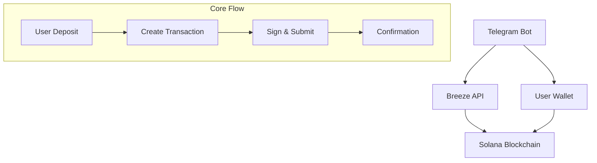

# Functionality


<video
  controls
  className="w-full aspect-video rounded-lg shadow-lg center"
  src="/Integration-Guide/videos/tg-bot-using-breeze-api.mp4"
  poster="/Integration-Guide/videos/banner-api.jpeg"
>
  Your browser does not support the video tag.
</video>

# Test it yourself

If the bot will be running on our hardware, then you will be able to test it yourself.
You can find it under **@breeze_integration_bot** handle or under [this link](https://t.me/breeze_integration_bot). 

# Code Location

<Card
      title="GitHub Repo"
      icon={<svg xmlns="http://www.w3.org/2000/svg" width="28" height="28" viewBox="0 0 24 24" fill="none" stroke="#bc07c9" stroke-width="2" stroke-linecap="round" stroke-linejoin="round" class="lucide lucide-bot-icon lucide-bot"><path d="M12 8V4H8"/><rect width="16" height="12" x="4" y="8" rx="2"/><path d="M2 14h2"/><path d="M20 14h2"/><path d="M15 13v2"/><path d="M9 13v2"/></svg>}
      href="https://github.com/anagrambuild/breeze-integration-examples/tree/master/telegram-bot-using-breeze-api"
    >
    Find out the github repository with the full code  
</Card>

# Explination
## Overview

The Breeze Protocol integration enables:
- **Simplified User Experience**: No manual fund account initialization required
- **Real-time Balance Tracking**: Live updates from the Breeze API
- **Multi-Asset Support**: USDC, USDT, PYUSD, and USDS compatibility
- **Seamless Transactions**: Direct deposit and withdrawal flow

<Info>
The Breeze API handles user fund account creation automatically, eliminating the need for manual initialization flows.
</Info>

## Architecture



## Architecture


## API Configuration

### Environment Variables

```typescript
const BOT_TOKEN = process.env.BOT_TOKEN!;
const SOLANA_RPC_URL = process.env.SOLANA_RPC_URL || 'https://api.mainnet-beta.solana.com';
const BREEZE_API_KEY = process.env.BREEZE_API_KEY!;
const BREEZE_FUND_ID = process.env.BREEZE_FUND_ID!;
```

### Base URL
```
https://api.breeze.baby/
```

<Warning>
Ensure your API key is kept secure and never exposed in client-side code.
</Warning>

## Core API Endpoints

### 1. Deposit Transaction

Creates a deposit transaction for transferring stablecoins to Breeze.

```typescript
POST /deposit/tx
```

**Request Body:**
```json
{
  "params": {
    "fund_id": "string",
    "amount": number,
    "all": boolean,
    "user_key": "string",
    "payer_key": null
  }
}
```

**Response (Success):**
```typescript
// Returns serialized transaction as string
"base64_encoded_transaction_string"
```

**Response (Error):**
```json
{
  "message": "Error description"
}
```

### 2. Withdraw Transaction

Creates a withdrawal transaction for extracting funds from Breeze.

```typescript
POST /withdraw/tx
```

**Request Body:**
```json
{
  "params": {
    "fund_id": "string",
    "amount": number,
    "all": boolean,
    "user_key": "string",
    "payer_key": null
  }
}
```

### 3. User Balances

Fetches detailed user balance information from Breeze.

```typescript
GET /user-balances/{user_pubkey}
```

**Response:**
```json
{
  "data": [
    {
      "token_address": "string",
      "token_symbol": "USDC",
      "token_name": "USD Coin",
      "decimals": 6,
      "total_balance": 1000000,
      "yield_balance": {
        "fund_id": "fund_123",
        "funds": "500000",
        "amount_of_yield": "25000",
        "fund_apy": 5.10
      }
    }
  ],
  "meta": {
    "page": 1,
    "per_page": 10,
    "total": 1,
    "total_pages": 1,
    "has_more": false
  }
}
```

### 4. User Yield History

Fetches user yield history and statistics.

```typescript
GET /user-yield/{user_pubkey}?page=1&limit=10&fund_id=optional
```

**Response:**
```json
{
  "data": [
    {
      "fund_id": "fund_123",
      "fund_name": "USDC Yield Fund",
      "base_asset": "USDC",
      "position_value": "500000",
      "yield_earned": "25000",
      "apy": "5.10",
      "entry_date": "2024-01-15T10:30:00Z",
      "last_updated": "2024-01-20T14:45:00Z"
    }
  ],
  "meta": {
    "page": 1,
    "per_page": 10,
    "total": 1,
    "total_pages": 1,
    "has_more": false
  }
}
```

## Implementation Guide

### Token Configuration

```typescript
const TOKEN_DECIMALS = {
    USDC: 6,
    USDT: 6,
    PYUSD: 6,
    USDS: 6,
    SOL: 9
};

const TOKEN_MINTS = {
    USDC: 'EPjFWdd5AufqSSqeM2qN1xzybapC8G4wEGGkZwyTDt1v',
    USDT: 'Es9vMFrzaCERmJfrF4H2FYD4KCoNkY7xgxACzBn3wqHg',
    PYUSD: 'CXk2AMBfi3TwaEL2468s6zP8xq9NxTXjp9gjMgzeUynM',
    USDS: '2b1kV6DkPAnxd5ixfnxCpjxmKwqjjaYmCZfHsFu24GXo'
};
```

### API Response Interfaces

```typescript
// API response types matching current implementation
type BreezeApiResponseUpdated =
    | string // when the response is just the serialized transaction
    | { message: string }; // when there's an error

interface BreezeUserBalancesInstance {
    token_address: string;
    token_symbol: string;
    token_name: string;
    decimals: number;
    total_balance: number;
    yield_balance: BreezeUserBalancesYieldsInstance;
}

interface BreezeUserBalancesYieldsInstance {
    fund_id: string;
    funds: string; // amount of funds in token units
    amount_of_yield: string; // yield earned in token units
    fund_apy: number;
}

interface BreezeUserBalancesResponse {
    data: BreezeUserBalancesInstance[];
    meta: {
        page: number;
        per_page: number;
        total: number;
        total_pages: number;
        has_more: boolean;
    }
}

interface BreezeUserYieldInstance {
    fund_id: string;
    fund_name: string;
    base_asset: string;
    position_value: string; // in token units
    yield_earned: string; // in token units
    apy: string;
    entry_date: string;
    last_updated: string;
}

interface BreezeUserYieldResponse {
    data: BreezeUserYieldInstance[];
    meta: {
        page: number;
        per_page: number;
        total: number;
        total_pages: number;
        has_more: boolean;
    }
}

interface UserData {
    keypair?: Keypair;
    publicKey?: string;
    currentMenu?: string;
    pendingTransaction?: {
        serializedTx: string;
        type: 'deposit' | 'withdraw';
        amount?: number;
        asset?: string;
    };
}
```

### Core Integration Class

```typescript
class BreezeBot {
    private bot: TelegramBot;
    private connection: Connection;
    private users: Map<number, UserData> = new Map();

    constructor() {
        this.bot = new TelegramBot(BOT_TOKEN, { polling: true });
        this.connection = new Connection(SOLANA_RPC_URL);
        this.setupHandlers();
    }

    // Precise BigInt token amount conversion
    private convertToTokenAmount(humanAmount: number, tokenSymbol: string): bigint {
        const decimals = TOKEN_DECIMALS[tokenSymbol as keyof typeof TOKEN_DECIMALS] || 6;
        const amountStr = humanAmount.toFixed(decimals);
        const [integerPart, decimalPart = ''] = amountStr.split('.');
        const paddedDecimal = decimalPart.padEnd(decimals, '0').slice(0, decimals);
        const fullAmountStr = integerPart + paddedDecimal;
        return BigInt(fullAmountStr);
    }

    private convertFromTokenAmount(tokenAmount: bigint, tokenSymbol: string): number {
        const decimals = TOKEN_DECIMALS[tokenSymbol as keyof typeof TOKEN_DECIMALS] || 6;
        const divisor = BigInt(10 ** decimals);
        const integerPart = Number(tokenAmount / divisor);
        const remainder = tokenAmount % divisor;
        const decimalPart = Number(remainder) / Number(divisor);
        return integerPart + decimalPart;
    }

    // Balance handling with exact amounts
    private async getBalances(publicKey: string) {
        try {
            const pubKey = new PublicKey(publicKey);
            const solBalance = await this.connection.getBalance(pubKey) / 1e9;

            const balances = {
                sol: solBalance,
                usdc: { raw: BigInt(0), human: 0 },
                usdt: { raw: BigInt(0), human: 0 },
                pyusd: { raw: BigInt(0), human: 0 },
                usds: { raw: BigInt(0), human: 0 }
            };

            for (const [symbol, mint] of Object.entries(TOKEN_MINTS)) {
                try {
                    const tokenMint = new PublicKey(mint);
                    const tokenAccount = await getAssociatedTokenAddress(tokenMint, pubKey);
                    const accountInfo = await getAccount(this.connection, tokenAccount);

                    const rawAmount = BigInt(accountInfo.amount.toString());
                    const humanAmount = this.convertFromTokenAmount(rawAmount, symbol);

                    const key = symbol.toLowerCase() as 'usdc' | 'usdt' | 'pyusd' | 'usds';
                    balances[key] = { raw: rawAmount, human: humanAmount };
                } catch (error) {
                    // Token account doesn't exist, balance remains 0
                }
            }

            return balances;
        } catch (error) {
            console.error('Error fetching balances:', error);
            return {
                sol: 0,
                usdc: { raw: BigInt(0), human: 0 },
                usdt: { raw: BigInt(0), human: 0 },
                pyusd: { raw: BigInt(0), human: 0 },
                usds: { raw: BigInt(0), human: 0 }
            };
        }
    }

    private async getUserCurrentValue(userPublicKey: string): Promise<number> {
        try {
            const balanceData = await this.getUserBalances(userPublicKey);
            if (!balanceData) return 0;

            let totalPortfolioValue = 0;
            for (const balance of balanceData.data) {
                if (!balance.yield_balance) continue;
                
                // Convert from token amount to human readable
                const humanAmount = this.convertFromTokenAmount(
                    BigInt(balance.yield_balance.funds), 
                    balance.token_symbol
                );
                totalPortfolioValue += humanAmount;
            }
            return totalPortfolioValue;
        } catch (error) {
            console.error('Error fetching user current value:', error);
            return 0;
        }
    }

    private async getUserBalances(userPublicKey: string): Promise<BreezeUserBalancesResponse | null> {
        try {
            const response = await fetch(`https://api.breeze.baby/user-balances/${userPublicKey}`, {
                method: 'GET',
                headers: {
                    "Content-Type": "application/json",
                    "x-api-key": BREEZE_API_KEY
                }
            });

            if (!response.ok) {
                console.error('Error fetching user balances: HTTP', response.status);
                return null;
            }

            const data = await response.json() as BreezeUserBalancesResponse;
            return data;
        } catch (error) {
            console.error('Error fetching user balances:', error);
            return null;
        }
    }

    private async getUserYield(userPublicKey: string, fundId?: string, page: number = 1, limit: number = 10): Promise<BreezeUserYieldResponse | null> {
        try {
            let url = `https://api.breeze.baby/user-yield/${userPublicKey}?page=${page}&limit=${limit}`;
            if (fundId) {
                url += `&fund_id=${fundId}`;
            }

            const response = await fetch(url, {
                method: 'GET',
                headers: {
                    "Content-Type": "application/json",
                    "x-api-key": BREEZE_API_KEY
                }
            });

            if (!response.ok) {
                console.error('Error fetching user yield: HTTP', response.status);
                return null;
            }

            const data = await response.json() as BreezeUserYieldResponse;
            return data;
        } catch (error) {
            console.error('Error fetching user yield:', error);
            return null;
        }
    }
}
```

### Real-time Yield Data

```typescript
private async getBreezeYieldFromAPI(userPublicKey: string): Promise<number> {
    try {
        const yieldData = await this.getUserYield(userPublicKey);
        if (!yieldData || !yieldData.data || yieldData.data.length === 0) {
            return 0;
        }

        // Calculate average APY from all positions
        let totalAPY = 0;
        let count = 0;

        for (const position of yieldData.data) {
            const apy = parseFloat(position.apy);
            if (!isNaN(apy)) {
                totalAPY += apy;
                count++;
            }
        }

        return count > 0 ? totalAPY / count : 0;
    } catch (error) {
        console.error('Error calculating Breeze yield:', error);
        return 0;
    }
}
```

### Deposit Flow Implementation

```typescript
private async processDeposit(chatId: number, percentage?: number, customAmount?: number) {
    const userData = this.users.get(chatId)!;
    const balances = await this.getBalances(userData.publicKey!);

    let tokenAmount: bigint;
    let humanAmount: number;
    let isAll = false;

    if (percentage === 100) {
        // Use exact raw balance for 100%
        tokenAmount = balances.usdc.raw;
        humanAmount = balances.usdc.human;
        isAll = true;
    } else if (percentage === 50) {
        // Calculate 50% of raw balance
        tokenAmount = balances.usdc.raw / BigInt(2);
        humanAmount = this.convertFromTokenAmount(tokenAmount, 'USDC');
    } else if (customAmount) {
        humanAmount = customAmount;
        tokenAmount = this.convertToTokenAmount(customAmount, 'USDC');
    } else {
        return;
    }

    if (tokenAmount <= 0) {
        await this.bot.sendMessage(chatId, '❌ Insufficient USDC balance!');
        return;
    }

    try {
        const requestBody = {
            "params": {
                "fund_id": BREEZE_FUND_ID,
                "amount": Number(tokenAmount), // Convert BigInt to number for API
                "all": isAll,
                "user_key": userData.publicKey,
                "payer_key": null
            }
        };

        const response = await fetch('https://api.breeze.baby/deposit/tx', {
            method: 'POST',
            headers: {
                "Content-Type": "application/json",
                "x-api-key": BREEZE_API_KEY
            },
            body: JSON.stringify(requestBody)
        });

        const data = await response.json() as BreezeApiResponseUpdated;

        // Handle error response
        if (typeof data === 'object' && 'message' in data) {
            await this.bot.sendMessage(chatId, `❌ Error: ${data.message}`);
            return;
        }

        // Store pending transaction
        userData.pendingTransaction = {
            serializedTx: data,
            type: 'deposit',
            amount: humanAmount,
            asset: 'USDC'
        };

        await this.showTransactionConfirmation(chatId, 'deposit', humanAmount, 'USDC');
    } catch (error) {
        console.error('Deposit error:', error);
        await this.bot.sendMessage(chatId, '❌ Failed to create deposit transaction. Please try again.');
    }
}
```

### Withdraw Flow Implementation

```typescript
private async processWithdraw(chatId: number, percentage?: number, customAmount?: number) {
    const userData = this.users.get(chatId)!;
    const breezeBalance = await this.getUserCurrentValue(userData.publicKey!);

    let humanAmount: number;
    let isAll = false;

    if (percentage === 100) {
        humanAmount = breezeBalance;
        isAll = true;
    } else if (percentage === 50) {
        humanAmount = breezeBalance * 0.5;
    } else if (customAmount) {
        humanAmount = customAmount;
    } else {
        return;
    }

    if (humanAmount <= 0) {
        await this.bot.sendMessage(chatId, '❌ No funds available to withdraw!');
        return;
    }

    const tokenAmount = this.convertToTokenAmount(humanAmount, 'USDC');

    try {
        const requestBody = {
            "params": {
                "fund_id": BREEZE_FUND_ID,
                "amount": Number(tokenAmount),
                "all": isAll,
                "user_key": userData.publicKey,
                "payer_key": null
            }
        };

        const response = await fetch('https://api.breeze.baby/withdraw/tx', {
            method: 'POST',
            headers: {
                "Content-Type": "application/json",
                "x-api-key": BREEZE_API_KEY
            },
            body: JSON.stringify(requestBody)
        });

        const data = await response.json() as BreezeApiResponseUpdated;

        if (typeof data === 'object' && 'message' in data) {
            await this.bot.sendMessage(chatId, `❌ Error: ${data.message}`);
            return;
        }

        userData.pendingTransaction = {
            serializedTx: data,
            type: 'withdraw',
            amount: humanAmount,
            asset: 'USDC'
        };

        await this.showTransactionConfirmation(chatId, 'withdraw', humanAmount, 'USDC');
    } catch (error) {
        console.error('Withdraw error:', error);
        await this.bot.sendMessage(chatId, '❌ Failed to create withdrawal transaction. Please try again.');
    }
}
```

## Enhanced Features

### Main Dashboard Interface

```typescript
private async showMainInterface(chatId: number) {
    const userData = this.users.get(chatId)!;
    const publicKey = userData.publicKey!;
    const balances = await this.getBalances(publicKey);
    const breezeBalance = await this.getUserCurrentValue(publicKey);
    const currentYield = await this.getBreezeYieldFromAPI(publicKey);

    const message =
        '🌊 **BREEZE INTEGRATION BOT** 🌊\n\n' +
        `💳 Wallet: \`${publicKey.slice(0, 8)}...${publicKey.slice(-8)}\`\n\n` +
        '💰 **Balances:**\n' +
        `• SOL: ${balances.sol.toFixed(4)} ◎\n` +
        `• USDC: ${balances.usdc.human.toFixed(2)} 💵\n` +
        `• USDT: ${balances.usdt.human.toFixed(2)} 💵\n` +
        `• PYUSD: ${balances.pyusd.human.toFixed(2)} 💵\n` +
        `• USDS: ${balances.usds.human.toFixed(2)} 💵\n\n` +
        `🌊 **Breeze Balance:** $${breezeBalance.toFixed(2)}\n` +
        `📈 **Current APY:** ${currentYield.toFixed(2)}%\n\n` +
        '🚀 Ready to earn yield with Breeze!';

    const keyboard = {
        inline_keyboard: [
            [{ text: '🌊 Earn Yield with Breeze', callback_data: 'earn_yield' }],
            [
                { text: '💳 Detailed Balances', callback_data: 'view_balances' },
                { text: '📈 Yield History', callback_data: 'view_yield_history' }
            ],
            [
                { text: '💸 Buy', callback_data: 'buy_mock' },
                { text: '💰 Sell', callback_data: 'sell_mock' }
            ],
            [
                { text: '📊 Positions', callback_data: 'positions_mock' },
                { text: '📋 Limit Orders', callback_data: 'limit_orders_mock' }
            ],
            [
                { text: '👥 Copy Trade', callback_data: 'copy_trade_mock' },
                { text: '⚙️ Settings', callback_data: 'settings_mock' }
            ],
            [{ text: '🎯 Slippage Settings', callback_data: 'slippage_mock' }]
        ]
    };

    await this.bot.sendMessage(chatId, message, {
        parse_mode: 'Markdown',
        reply_markup: keyboard
    });
}
```

## Transaction Management

### Transaction Confirmation Flow

```typescript
private async showTransactionConfirmation(chatId: number, type: string, amount: number, asset: string) {
    const message =
        `✅ **Confirm ${type.charAt(0).toUpperCase() + type.slice(1)}** ✅\n\n` +
        `💰 Amount: ${amount.toFixed(6)} ${asset}\n` +
        `🎯 Action: ${type.charAt(0).toUpperCase() + type.slice(1)} ${type === 'deposit' ? 'to' : 'from'} Breeze\n\n` +
        '⚠️ Please confirm this transaction:';

    const keyboard = {
        inline_keyboard: [
            [{ text: '✅ Confirm Transaction', callback_data: 'confirm_transaction' }],
            [{ text: '❌ Cancel', callback_data: 'earn_yield' }]
        ]
    };

    await this.bot.sendMessage(chatId, message, {
        parse_mode: 'Markdown',
        reply_markup: keyboard
    });
}
```

### Transaction Signing and Submission

```typescript
private async confirmTransaction(chatId: number) {
    const userData = this.users.get(chatId)!;
    const pendingTx = userData.pendingTransaction;

    if (!pendingTx) {
        await this.bot.sendMessage(chatId, '❌ No pending transaction found.');
        return;
    }

    try {
        if (!pendingTx.serializedTx) {
            await this.bot.sendMessage(chatId, '❌ Invalid transaction data.');
            return;
        }

        this.logTransactionDetails(pendingTx.serializedTx, 'CONFIRMING');

        const transaction = VersionedTransaction.deserialize(Buffer.from(pendingTx.serializedTx, 'base64'));
        transaction.sign([userData.keypair!]);

        const signature = await this.connection.sendTransaction(transaction);

        await this.bot.sendMessage(chatId, '⏳ Transaction sent! Waiting for confirmation...');

        const confirmation = await this.connection.confirmTransaction(signature, 'confirmed');

        if (confirmation.value.err) {
            await this.bot.sendMessage(chatId, '❌ Transaction failed!');
            return;
        }

        const action = pendingTx.type === 'deposit' ? 'deposited to' : 'withdrawn from';
        await this.bot.sendMessage(chatId,
            `🎉 **Successfully ${action} Breeze!**\n\n` +
            `💰 Amount: ${pendingTx.amount?.toFixed(2)} ${pendingTx.asset}\n` +
            `🔗 Transaction: \`${signature}\``,
            { parse_mode: 'Markdown' }
        );

        setTimeout(() => this.showMainInterface(chatId), 2000);

        // Clear pending transaction
        userData.pendingTransaction = undefined;

    } catch (error) {
        console.error('Transaction error:', error);
        await this.bot.sendMessage(chatId, '❌ Failed to process transaction. Please try again.');
    }
}
```

## Error Handling

### API Error Responses

```typescript
// Handle different response types
const data = await response.json() as BreezeApiResponseUpdated;

if (typeof data === 'object' && 'message' in data) {
    await this.bot.sendMessage(chatId, `❌ Error: ${data.message}`);
    return;
}

// data is now the serialized transaction string
```

### Common Error Scenarios

#### Insufficient Balance
```typescript
if (tokenAmount <= 0) {
    await this.bot.sendMessage(chatId, '❌ Insufficient USDC balance!');
    return;
}
```

#### Network Errors
```typescript
try {
    const response = await fetch(apiUrl);
    if (!response.ok) {
        console.error('HTTP Error:', response.status);
        return null;
    }
    // ... process response
} catch (error) {
    console.error('Network error:', error);
    await this.bot.sendMessage(chatId, '❌ Network error. Please try again.');
}
```

#### Transaction Failures
```typescript
const confirmation = await this.connection.confirmTransaction(signature, 'confirmed');

if (confirmation.value.err) {
    await this.bot.sendMessage(chatId, '❌ Transaction failed!');
    return;
}
```

## Best Practices

### 1. Token Amount Conversion

Always use precise decimal handling for token amounts:

```typescript
private convertToTokenAmount(humanAmount: number, tokenSymbol: string): bigint {
    const decimals = TOKEN_DECIMALS[tokenSymbol as keyof typeof TOKEN_DECIMALS] || 6;
    const amountStr = humanAmount.toFixed(decimals);
    const [integerPart, decimalPart = ''] = amountStr.split('.');
    const paddedDecimal = decimalPart.padEnd(decimals, '0').slice(0, decimals);
    const fullAmountStr = integerPart + paddedDecimal;
    return BigInt(fullAmountStr);
}
```

### 2. Real-time Balance Updates

Fetch current values before each operation:

```typescript
const currentBalance = await this.getUserCurrentValue(userPublicKey);
const currentYield = await this.getBreezeYieldFromAPI(userPublicKey);
```

### 3. User Experience

- Show loading states during API calls
- Provide clear error messages
- Implement transaction confirmation UI
- Display real-time balance updates
- Support both percentage and custom amounts

## Monitoring and Logging

### Transaction Logging

```typescript
private logTransactionDetails(serializedTx: string, context: string) {
    try {
        console.log(`\n=== ${context} TRANSACTION DEBUG ===`);
        console.log('Serialized TX (base64):', serializedTx.substring(0, 100) + '...');

        const transaction = VersionedTransaction.deserialize(Buffer.from(serializedTx, 'base64'));

        console.log('Transaction details:');
        console.log('- Version:', transaction.version);
        console.log('- Message keys:', transaction.message.staticAccountKeys.length);
        console.log('- Instructions:', transaction.message.compiledInstructions.length);
        console.log('- Account keys:');
        transaction.message.staticAccountKeys.forEach((key, index) => {
            console.log(`  [${index}]: ${key.toString()}`);
        });

        console.log('===========================\n');
    } catch (error) {
        console.error(`Failed to deserialize transaction in ${context}:`, error);
        console.log('Raw serialized data:', serializedTx);
    }
}
```

### Performance Monitoring

Track API response times and success rates:

```typescript
const startTime = Date.now();
const response = await fetch(apiUrl);
const responseTime = Date.now() - startTime;

console.log(`API call took ${responseTime}ms`);
```

## Environment Setup

### Required Environment Variables

```bash
# Telegram Bot Configuration
BOT_TOKEN=your_telegram_bot_token_here

# Solana Configuration
SOLANA_RPC_URL=https://api.mainnet-beta.solana.com

# Breeze API Configuration
BREEZE_API_KEY=your_breeze_api_key_here
BREEZE_FUND_ID=your_breeze_fund_id
```

## Build and Run

```bash
# Install dependencies
npm install

# Build the project
npm run build

# Start the bot
npm start
```

## Key Features

### Wallet Management
- **Keypair Generation**: Create new Solana keypairs securely
- **Private Key Import**: Import existing wallets using base58 encoded private keys
- **Balance Tracking**: Real-time SOL and SPL token balance monitoring with BigInt precision

### Advanced Yield Farming
- **Real-time Portfolio**: Live tracking of deposited amounts and yield earnings
- **Live APY Data**: Real-time yield rates calculated from multiple positions
- **Detailed Analytics**: Comprehensive balance breakdowns by asset and fund
- **Yield History**: Track earnings over time with pagination support

### Enhanced User Experience
- **Inline Keyboards**: Rich interactive interfaces with buttons and menus
- **Progressive Disclosure**: Step-by-step flows for complex operations
- **Real-time Data**: All data fetched live from Breeze APIs with BigInt precision
- **Error Handling**: Comprehensive error messages and recovery options
- **Transaction Feedback**: Real-time updates during transaction processing
## Troubleshooting

<AccordionGroup>
<Accordion title="API Connection Issues">
- Verify API key is correct and active
- Check network connectivity to Breeze API
- Ensure proper environment variable configuration
- Review API rate limits and quotas
</Accordion>

<Accordion title="Transaction Failures">
- Check user has sufficient SOL for transaction fees
- Verify token account exists and has sufficient balance
- Ensure transaction isn't expired or malformed
- Check Solana network status
</Accordion>

<Accordion title="Balance Discrepancies">
- API provides real-time data from Breeze
- Check for pending transactions
- Verify decimal conversion accuracy
- Review fund calculation logic
</Accordion>
</AccordionGroup>

