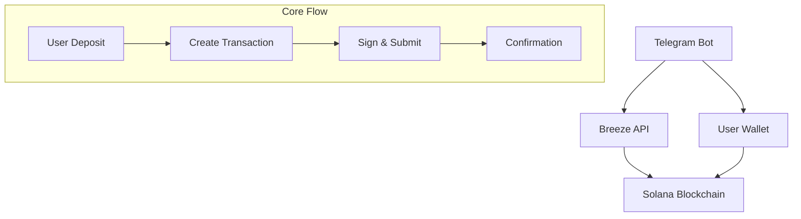

# Functionality


<video
  controls
  className="w-full aspect-video rounded-lg shadow-lg center"
  src="/Integration-Guide/videos/tg-bot-using-breeze-api.mp4"
  poster="/Integration-Guide/videos/banner-api.jpeg"
>
  Your browser does not support the video tag.
</video>

# Test it yourself

If the bot will be running on our hardware, then you will be able to test it yourself.
You can find it under **@breeze_integration_bot** handle or under [this link](https://t.me/breeze_integration_bot). 

# Code Location

<Card
      title="GitHub Repo"
      icon={<svg xmlns="http://www.w3.org/2000/svg" width="28" height="28" viewBox="0 0 24 24" fill="none" stroke="#bc07c9" stroke-width="2" stroke-linecap="round" stroke-linejoin="round" class="lucide lucide-bot-icon lucide-bot"><path d="M12 8V4H8"/><rect width="16" height="12" x="4" y="8" rx="2"/><path d="M2 14h2"/><path d="M20 14h2"/><path d="M15 13v2"/><path d="M9 13v2"/></svg>}
      href="https://github.com/anagrambuild/breeze-integration-examples/tree/master/telegram-bot-using-breeze-api"
    >
    Find out the github repository with the full code  
</Card>

# Explination
## Overview

The Breeze Protocol integration enables:
- **Simplified User Experience**: No manual fund account initialization required
- **Real-time Balance Tracking**: Live updates from the Breeze API
- **Multi-Asset Support**: USDC, USDT, PYUSD, and USDS compatibility
- **Seamless Transactions**: Direct deposit and withdrawal flow

<Info>
The Breeze API handles user fund account creation automatically, eliminating the need for manual initialization flows.
</Info>

## Architecture



{/* ```mermaid
graph TB
    subgraph "User Flow"
        A[User Initiates Deposit] --> B[Deposit Funds]
        B --> C[View Transaction Logs]
        C --> D[Monitor Deposited Amount]
        D --> E[Check Balance & APY]
        E --> F[Decide to Withdraw]
        F --> G[Withdraw Funds]
        G --> H[Transaction Complete]
    end

    subgraph "Integration Flow"
        I[User Deposit Request] --> J[Call /ixs API Endpoint]
        J --> K[Get Deposit Transaction]
        K --> L[User Signs Transaction]
        L --> M[Submit Transaction]
        M --> N[Check User Stats]
        N --> O[Call Stats Endpoint]
        O --> P[Calculate APY]
        P --> Q[Get Current Balance]
        Q --> R[Display to User]
        R --> S[User Withdraw Request]
        S --> T[Call /single ix API Endpoint]
        T --> U[Get Withdraw Transaction]
        U --> V[User Signs Transaction]
        V --> W[Submit Transaction]
        W --> X[Update Balance]
    end
``` */}

## API Configuration

### Environment Variables

```typescript
const BREEZE_API_KEY = process.env.BREEZE_API_KEY!;
const BREEZE_FUND_ID = process.env.BREEZE_FUND_ID!;
const SOLANA_RPC_URL = process.env.SOLANA_RPC_URL || 'https://api.mainnet-beta.solana.com';
```

### Base URL
```
https://api.breeze.baby/
```

<Warning>
Ensure your API key is kept secure and never exposed in client-side code.
</Warning>

## Core API Endpoints

### 1. Deposit Transaction

Creates a deposit transaction for transferring stablecoins to Breeze.

```typescript
POST /deposit/tx
```

**Request Body:**
```json
{
  "params": {
    "fund_id": "string",
    "amount": number,
    "all": boolean,
    "user_key": "string",
    "payer_key": null
  }
}
```

**Response:**
```json
{
  "success": true,
  "result": "base64_encoded_transaction"
}
```

### 2. Withdraw Transaction

Creates a withdrawal transaction for extracting funds from Breeze.

```typescript
POST /withdraw/tx
```

**Request Body:**
```json
{
  "params": {
    "fund_id": "string",
    "amount": number,
    "all": boolean,
    "user_key": "string",
    "payer_key": null
  }
}
```

### 3. User Balances

Fetches detailed user balance information from Breeze.

```typescript
GET /user-balances/{user_pubkey}
```

**Response:**
```json
{
  "balances": [
    {
      "asset": "USDC",
      "symbol": "USDC", 
      "wallet_balance": "1000.00",
      "total_balance": "1525.50",
      "total_yield": "25.50",
      "fund_positions": [
        {
          "fund_id": "fund_123",
          "fund_name": "USDC Yield Fund",
          "position_value": "500.00",
          "yield_earned": "25.50",
          "apy": "5.10"
        }
      ]
    }
  ],
  "total_portfolio_value": "1525.50",
  "total_yield_earned": "25.50"
}
```

### 4. User Yield History

Fetches user yield history and statistics.

```typescript
GET /user-yield/{user_pubkey}?page=1&limit=10&fund_id=optional
```

**Response:**
```json
{
  "yields": [
    {
      "fund_id": "fund_123",
      "fund_name": "USDC Yield Fund", 
      "base_asset": "USDC",
      "position_value": "500.00",
      "yield_earned": "25.50",
      "apy": "5.10",
      "entry_date": "2024-01-15T10:30:00Z",
      "last_updated": "2024-01-20T14:45:00Z"
    }
  ],
  "pagination": {
    "page": 1,
    "limit": 10,
    "total_items": 1,
    "total_pages": 1
  },
  "total_yield_earned": "25.50"
}
```

## Implementation Guide

### Token Configuration

```typescript
const TOKEN_DECIMALS = {
    USDC: 6,
    USDT: 6,
    PYUSD: 6,
    USDS: 6,
    SOL: 9
};

const TOKEN_MINTS = {
    USDC: 'EPjFWdd5AufqSSqeM2qN1xzybapC8G4wEGGkZwyTDt1v',
    USDT: 'Es9vMFrzaCERmJfrF4H2FYD4KCoNkY7xgxACzBn3wqHg',
    PYUSD: 'CXk2AMBfi3TwaEL2468s6zP8xq9NxTXjp9gjMgzeUynM',
    USDS: '2b1kV6DkPAnxd5ixfnxCpjxmKwqjjaYmCZfHsFu24GXo'
};
```

### Core Integration Class

```typescript
class BreezeBot {
    private async getUserCurrentValue(userPublicKey: string): Promise<number> {
        try {
            // Use the new user-balances endpoint to get the total portfolio value
            const balanceData = await this.getUserBalances(userPublicKey);
            
            if (!balanceData) {
                return 0;
            }

            return parseFloat(balanceData.total_portfolio_value) || 0;
        } catch (error) {
            console.error('Error fetching user current value:', error);
            return 0;
        }
    }

    private async getUserBalances(userPublicKey: string): Promise<BreezeUserBalancesResponse | null> {
        try {
            const response = await fetch(`https://api.breeze.baby/user-balances/${userPublicKey}`, {
                method: 'GET',
                headers: {
                    "Content-Type": "application/json",
                    "x-api-key": BREEZE_API_KEY
                }
            });

            if (!response.ok) {
                console.error('Error fetching user balances: HTTP', response.status);
                return null;
            }

            const data = await response.json() as BreezeUserBalancesResponse;
            return data;
        } catch (error) {
            console.error('Error fetching user balances:', error);
            return null;
        }
    }
}
```

### Real-time Yield Data

```typescript
private async getBreezeYieldFromAPI(userPublicKey: string): Promise<number> {
    try {
        const yieldData = await this.getUserYield(userPublicKey);
        if (!yieldData || !yieldData.yields || yieldData.yields.length === 0) {
            return 0;
        }

        // Calculate average APY from all positions
        let totalAPY = 0;
        let count = 0;
        
        for (const position of yieldData.yields) {
            const apy = parseFloat(position.apy);
            if (!isNaN(apy)) {
                totalAPY += apy;
                count++;
            }
        }

        return count > 0 ? totalAPY / count : 0;
    } catch (error) {
        console.error('Error calculating Breeze yield:', error);
        return 0;
    }
}
```

### Deposit Flow Implementation

```typescript
private async processDeposit(chatId: number, percentage?: number, customAmount?: number) {
    const userData = this.users.get(chatId)!;
    const balances = await this.getBalances(userData.publicKey!);

    let tokenAmount: bigint;
    let humanAmount: number;
    let isAll = false;

    // Calculate amounts based on user selection
    if (percentage === 100) {
        tokenAmount = balances.usdc.raw;
        humanAmount = balances.usdc.human;
        isAll = true;
    } else if (percentage === 50) {
        tokenAmount = balances.usdc.raw / BigInt(2);
        humanAmount = this.convertFromTokenAmount(tokenAmount, 'USDC');
    } else if (customAmount) {
        humanAmount = customAmount;
        tokenAmount = this.convertToTokenAmount(customAmount, 'USDC');
    }

    if (tokenAmount <= 0) {
        await this.bot.sendMessage(chatId, '❌ Insufficient USDC balance!');
        return;
    }

    try {
        const requestBody = {
            "params": {
                "fund_id": BREEZE_FUND_ID,
                "amount": Number(tokenAmount),
                "all": isAll,
                "user_key": userData.publicKey,
                "payer_key": null
            }
        };

        // Call Breeze API for deposit
        const response = await fetch('https://api.breeze.baby/deposit/tx', {
            method: 'POST',
            headers: {
                "Content-Type": "application/json",
                "x-api-key": BREEZE_API_KEY
            },
            body: JSON.stringify(requestBody)
        });

        const data = await response.json() as BreezeApiResponse;
        
        if (data.success && data.result) {
            // Handle transaction signing and submission
            await this.handleTransaction(chatId, data.result, 'deposit', humanAmount);
        }
    } catch (error) {
        console.error('Deposit error:', error);
        await this.bot.sendMessage(chatId, '❌ Failed to create deposit transaction. Please try again.');
    }
}
```

### Withdraw Flow Implementation

```typescript
private async processWithdraw(chatId: number, percentage?: number, customAmount?: number) {
    const userData = this.users.get(chatId)!;
    const breezeBalance = await this.getUserCurrentValue(userData.publicKey!);

    let humanAmount: number;
    let isAll = false;

    if (percentage === 100) {
        humanAmount = breezeBalance;
        isAll = true;
    } else if (percentage === 50) {
        humanAmount = breezeBalance * 0.5;
    } else if (customAmount) {
        humanAmount = customAmount;
    }

    if (humanAmount <= 0) {
        await this.bot.sendMessage(chatId, '❌ No funds available to withdraw!');
        return;
    }

    const tokenAmount = this.convertToTokenAmount(humanAmount, 'USDC');

    try {
        const requestBody = {
            "params": {
                "fund_id": BREEZE_FUND_ID,
                "amount": Number(tokenAmount),
                "all": isAll,
                "user_key": userData.publicKey,
                "payer_key": null
            }
        };

        const response = await fetch('https://api.breeze.baby/withdraw/tx', {
            method: 'POST',
            headers: {
                "Content-Type": "application/json",
                "x-api-key": BREEZE_API_KEY
            },
            body: JSON.stringify(requestBody)
        });

        const data = await response.json() as BreezeApiResponse;
        
        if (data.success && data.result) {
            await this.handleTransaction(chatId, data.result, 'withdraw', humanAmount);
        }
    } catch (error) {
        console.error('Withdraw error:', error);
        await this.bot.sendMessage(chatId, '❌ Failed to create withdrawal transaction. Please try again.');
    }
}
```

## Enhanced Features

### Detailed Balance View

```typescript
private async showDetailedBalances(chatId: number) {
    const userData = this.users.get(chatId)!;
    const publicKey = userData.publicKey!;
    const breezeBalances = await this.getUserBalances(publicKey);

    if (!breezeBalances) {
        await this.bot.sendMessage(chatId, '❌ Unable to fetch Breeze balances. Please try again later.');
        return;
    }

    let message = '💳 **Detailed Breeze Balances** 💳\n\n';
    message += `💰 **Total Portfolio Value:** $${parseFloat(breezeBalances.total_portfolio_value).toFixed(2)}\n`;
    message += `🎯 **Total Yield Earned:** $${parseFloat(breezeBalances.total_yield_earned).toFixed(2)}\n\n`;

    if (breezeBalances.balances.length === 0) {
        message += 'No positions found in Breeze.';
    } else {
        for (const balance of breezeBalances.balances) {
            message += `**${balance.symbol}**\n`;
            message += `• Wallet Balance: ${parseFloat(balance.wallet_balance).toFixed(6)}\n`;
            message += `• Total Balance: ${parseFloat(balance.total_balance).toFixed(6)}\n`;
            message += `• Total Yield: $${parseFloat(balance.total_yield).toFixed(2)}\n`;

            if (balance.fund_positions.length > 0) {
                message += `• Fund Positions:\n`;
                for (const position of balance.fund_positions) {
                    message += `  - ${position.fund_name}: $${parseFloat(position.position_value).toFixed(2)} (APY: ${parseFloat(position.apy).toFixed(2)}%)\n`;
                }
            }
            message += '\n';
        }
    }

    const keyboard = {
        inline_keyboard: [
            [{ text: '🔙 Back to Main', callback_data: 'back_to_main' }]
        ]
    };

    await this.bot.sendMessage(chatId, message, {
        parse_mode: 'Markdown',
        reply_markup: keyboard
    });
}
```

### Yield History Tracking

```typescript
private async showYieldHistory(chatId: number) {
    const userData = this.users.get(chatId)!;
    const publicKey = userData.publicKey!;
    const yieldData = await this.getUserYield(publicKey);

    if (!yieldData) {
        await this.bot.sendMessage(chatId, '❌ Unable to fetch yield history. Please try again later.');
        return;
    }

    let message = '📈 **Yield History** 📈\n\n';
    message += `💰 **Total Yield Earned:** $${parseFloat(yieldData.total_yield_earned).toFixed(2)}\n\n`;

    if (yieldData.yields.length === 0) {
        message += 'No yield history found.';
    } else {
        for (const yieldEntry of yieldData.yields) {
            const entryDate = new Date(yieldEntry.entry_date).toLocaleDateString();
            const lastUpdated = new Date(yieldEntry.last_updated).toLocaleDateString();
            
            message += `**${yieldEntry.fund_name}** (${yieldEntry.base_asset})\n`;
            message += `• Position Value: $${parseFloat(yieldEntry.position_value).toFixed(2)}\n`;
            message += `• Yield Earned: $${parseFloat(yieldEntry.yield_earned).toFixed(2)}\n`;
            message += `• APY: ${parseFloat(yieldEntry.apy).toFixed(2)}%\n`;
            message += `• Entry Date: ${entryDate}\n`;
            message += `• Last Updated: ${lastUpdated}\n\n`;
        }

        if (yieldData.pagination.total_pages > 1) {
            message += `📄 Page ${yieldData.pagination.page} of ${yieldData.pagination.total_pages} (${yieldData.pagination.total_items} total items)`;
        }
    }

    const keyboard = {
        inline_keyboard: [
            [{ text: '🔙 Back to Main', callback_data: 'back_to_main' }]
        ]
    };

    await this.bot.sendMessage(chatId, message, {
        parse_mode: 'Markdown',
        reply_markup: keyboard
    });
}
```

## User Interface Components

### Enhanced Main Dashboard

```typescript
private async showMainInterface(chatId: number) {
    const userData = this.users.get(chatId)!;
    const publicKey = userData.publicKey!;
    const balances = await this.getBalances(publicKey);
    const breezeBalance = await this.getUserCurrentValue(publicKey);
    const currentYield = await this.getBreezeYieldFromAPI(publicKey);

    const message = `
🌊 **BREEZE INTEGRATION BOT** 🌊

💳 Wallet: \`${publicKey.slice(0, 8)}...${publicKey.slice(-8)}\`

💰 **Balances:**
• SOL: ${balances.sol.toFixed(4)} ◎
• USDC: ${balances.usdc.human.toFixed(2)} 💵
• USDT: ${balances.usdt.human.toFixed(2)} 💵
• PYUSD: ${balances.pyusd.human.toFixed(2)} 💵
• USDS: ${balances.usds.human.toFixed(2)} 💵

🌊 **Breeze Balance:** $${breezeBalance.toFixed(2)}
📈 **Current APY:** ${currentYield.toFixed(2)}%

🚀 Ready to earn yield with Breeze!
    `;

    const keyboard = {
        inline_keyboard: [
            [{ text: '🌊 Earn Yield with Breeze', callback_data: 'earn_yield' }],
            [
                { text: '💳 Detailed Balances', callback_data: 'view_balances' },
                { text: '📈 Yield History', callback_data: 'view_yield_history' }
            ],
            [
                { text: '💸 Buy', callback_data: 'buy_mock' },
                { text: '💰 Sell', callback_data: 'sell_mock' }
            ],
            [
                { text: '📊 Positions', callback_data: 'positions_mock' },
                { text: '📋 Limit Orders', callback_data: 'limit_orders_mock' }
            ]
        ]
    };

    await this.bot.sendMessage(chatId, message, {
        parse_mode: 'Markdown',
        reply_markup: keyboard
    });
}
```

### Yield Interface with Real Data

```typescript
private async showEarnYieldInterface(chatId: number) {
    const userData = this.users.get(chatId)!;
    const publicKey = userData.publicKey!;
    const balances = await this.getBalances(publicKey);
    const currentYield = await this.getBreezeYieldFromAPI(publicKey);
    const breezeBalance = await this.getUserCurrentValue(publicKey);

    const message = `
🌊 **Earn Yield with Breeze** 🌊

💰 **Current Balances:**
• USDC: ${balances.usdc.human.toFixed(2)} 💵
• USDT: ${balances.usdt.human.toFixed(2)} 💵
• PYUSD: ${balances.pyusd.human.toFixed(2)} 💵
• USDS: ${balances.usds.human.toFixed(2)} 💵

📈 **Current Breeze Yield:** ${currentYield.toFixed(1)}% APY
🌊 **Deposited in Breeze:** $${breezeBalance.toFixed(2)}

💡 Earn passive yield on your stablecoins!
    `;

    const keyboard = {
        inline_keyboard: [
            [
                { text: '📥 Deposit', callback_data: 'deposit' },
                { text: '📤 Withdraw', callback_data: 'withdraw' }
            ],
            [{ text: '🔙 Back to Main', callback_data: 'back_to_main' }]
        ]
    };

    await this.bot.sendMessage(chatId, message, {
        parse_mode: 'Markdown',
        reply_markup: keyboard
    });
}
```

## Transaction Management

### Transaction Confirmation Flow

```typescript
private async showTransactionConfirmation(chatId: number, type: string, amount: number, asset: string) {
    const message = `
✅ **Confirm ${type.charAt(0).toUpperCase() + type.slice(1)}** ✅

💰 Amount: ${amount.toFixed(6)} ${asset}
🎯 Action: ${type.charAt(0).toUpperCase() + type.slice(1)} ${type === 'deposit' ? 'to' : 'from'} Breeze

⚠️ Please confirm this transaction:
    `;

    const keyboard = {
        inline_keyboard: [
            [{ text: '✅ Confirm Transaction', callback_data: 'confirm_transaction' }],
            [{ text: '❌ Cancel', callback_data: 'earn_yield' }]
        ]
    };

    await this.bot.sendMessage(chatId, message, {
        parse_mode: 'Markdown',
        reply_markup: keyboard
    });
}
```

### Transaction Signing and Submission

```typescript
private async confirmTransaction(chatId: number) {
    const userData = this.users.get(chatId)!;
    const pendingTx = userData.pendingTransaction;

    if (!pendingTx?.serializedTx) {
        throw new Error('No pending transaction found');
    }

    try {
        // Deserialize and sign the transaction
        const transaction = VersionedTransaction.deserialize(
            Buffer.from(pendingTx.serializedTx, 'base64')
        );
        
        transaction.sign([userData.keypair!]);

        // Submit to Solana network
        const signature = await this.connection.sendTransaction(transaction);
        
        await this.bot.sendMessage(chatId, '⏳ Transaction sent! Waiting for confirmation...');

        // Wait for confirmation
        const confirmation = await this.connection.confirmTransaction(signature, 'confirmed');
        
        if (confirmation.value.err) {
            throw new Error('Transaction failed');
        }

        const action = pendingTx.type === 'deposit' ? 'deposited to' : 'withdrawn from';
        await this.bot.sendMessage(chatId, `
🎉 **Successfully ${action} Breeze!**

💰 Amount: ${pendingTx.amount?.toFixed(2)} ${pendingTx.asset}
🔗 Transaction: \`${signature}\`
        `, { parse_mode: 'Markdown' });

        // Clear pending transaction
        userData.pendingTransaction = undefined;
        
        setTimeout(() => this.showMainInterface(chatId), 2000);
    } catch (error) {
        console.error('Transaction error:', error);
        await this.bot.sendMessage(chatId, '❌ Failed to process transaction. Please try again.');
    }
}
```

## Error Handling

### API Error Responses

```typescript
interface BreezeApiResponse {
    success: boolean;
    result?: string;
    error?: string;
    [key: string]: any;
}

// Handle API errors
if (!data.success || data.error) {
    console.error('Breeze API Error:', data.error);
    throw new Error(data.error || 'Unknown API error');
}
```

### Common Error Scenarios

<AccordionGroup>
<Accordion title="Insufficient Balance">
When a user tries to deposit more than their available balance:

```typescript
if (tokenAmount <= 0) {
    await this.bot.sendMessage(chatId, '❌ Insufficient USDC balance!');
    return;
}
```
</Accordion>

<Accordion title="Network Errors">
Handle network connectivity issues:

```typescript
try {
    const response = await fetch(apiUrl);
    if (!response.ok) {
        console.error('HTTP Error:', response.status);
        return null;
    }
    // ... process response
} catch (error) {
    console.error('Network error:', error);
    await this.bot.sendMessage(chatId, '❌ Network error. Please try again.');
}
```
</Accordion>

<Accordion title="Transaction Failures">
Handle blockchain transaction failures:

```typescript
const confirmation = await this.connection.confirmTransaction(signature, 'confirmed');

if (confirmation.value.err) {
    await this.bot.sendMessage(chatId, '❌ Transaction failed!');
    return;
}
```
</Accordion>
</AccordionGroup>

## Best Practices

### 1. Token Amount Conversion

Always use precise decimal handling for token amounts:

```typescript
private convertToTokenAmount(humanAmount: number, tokenSymbol: string): bigint {
    const decimals = TOKEN_DECIMALS[tokenSymbol as keyof typeof TOKEN_DECIMALS] || 6;
    const amountStr = humanAmount.toFixed(decimals);
    const [integerPart, decimalPart = ''] = amountStr.split('.');
    const paddedDecimal = decimalPart.padEnd(decimals, '0').slice(0, decimals);
    const fullAmountStr = integerPart + paddedDecimal;
    return BigInt(fullAmountStr);
}
```

### 2. Real-time Balance Updates

Fetch current values before each operation:

```typescript
const currentBalance = await this.getUserCurrentValue(userPublicKey);
const currentYield = await this.getBreezeYieldFromAPI(userPublicKey);
```

### 3. User Experience

- Show loading states during API calls
- Provide clear error messages
- Implement transaction confirmation UI
- Display real-time balance updates

### 4. Security Considerations

- Validate all user inputs
- Use environment variables for sensitive data
- Implement rate limiting
- Log transactions for auditing

## Monitoring and Logging

### Transaction Logging

```typescript
private logTransactionDetails(serializedTx: string, context: string) {
    console.log(`\n=== ${context} TRANSACTION DEBUG ===`);
    console.log('Serialized TX:', serializedTx.substring(0, 100) + '...');
    
    try {
        const transaction = VersionedTransaction.deserialize(
            Buffer.from(serializedTx, 'base64')
        );
        
        console.log('Transaction details:', {
            version: transaction.version,
            messageKeys: transaction.message.staticAccountKeys.length,
            instructions: transaction.message.compiledInstructions.length
        });
    } catch (error) {
        console.error('Failed to deserialize transaction:', error);
    }
}
```

### Performance Monitoring

Track API response times and success rates:

```typescript
const startTime = Date.now();
const response = await fetch(apiUrl);
const responseTime = Date.now() - startTime;

console.log(`API call took ${responseTime}ms`);
```

## Environment Setup

### Required Environment Variables

```bash
# Telegram Bot Configuration
BOT_TOKEN=your_telegram_bot_token_here

# Solana Configuration
SOLANA_RPC_URL=https://api.mainnet-beta.solana.com

# Breeze API Configuration
BREEZE_API_KEY=your_breeze_api_key_here
BREEZE_FUND_ID=your_breeze_fund_id
```

## Build and Run

```bash
# Install dependencies
npm install

# Build the project
npm run build

# Start the bot
npm start
```

## API Methods Used

The bot integrates with these Breeze API endpoints:

- `GET /user-balances/{userId}` - Get detailed user balance information
- `GET /user-yield/{userId}?page=1&limit=10&fund_id=optional` - Get user yield history and stats
- `POST /deposit/tx` - Create deposit transactions
- `POST /withdraw/tx` - Create withdraw transactions

## Key Features

### Wallet Management
- **Keypair Generation**: Create new Solana keypairs securely
- **Private Key Import**: Import existing wallets using base58 encoded private keys
- **Balance Tracking**: Real-time SOL and SPL token balance monitoring
- **Multi-Asset Support**: USDC, USDT, PYUSD, and USDS compatibility

### Advanced Yield Farming
- **Seamless Deposits**: Deposit stablecoins into Breeze yield funds
- **Flexible Withdrawals**: Withdraw with percentage options (50%, 100%) or custom amounts
- **Real-time Portfolio**: Live tracking of deposited amounts and yield earnings
- **Live APY Data**: Real-time yield rates from the Breeze API
- **Detailed Analytics**: Comprehensive balance breakdowns by asset and fund
- **Yield History**: Track earnings over time with pagination support

### Enhanced User Experience
- **Inline Keyboards**: Rich interactive interfaces with buttons and menus
- **Progressive Disclosure**: Step-by-step flows for complex operations
- **Real-time Data**: All data fetched live from Breeze APIs
- **Error Handling**: Comprehensive error messages and recovery options
- **Transaction Feedback**: Real-time updates during transaction processing

## Troubleshooting

<AccordionGroup>
<Accordion title="API Connection Issues">
- Verify API key is correct and active
- Check network connectivity to Breeze API
- Ensure proper environment variable configuration
- Review API rate limits and quotas
</Accordion>

<Accordion title="Transaction Failures">
- Check user has sufficient SOL for transaction fees
- Verify token account exists and has sufficient balance
- Ensure transaction isn't expired or malformed
- Check Solana network status
</Accordion>

<Accordion title="Balance Discrepancies">
- API provides real-time data from Breeze
- Check for pending transactions
- Verify decimal conversion accuracy
- Review fund calculation logic
</Accordion>
</AccordionGroup>

