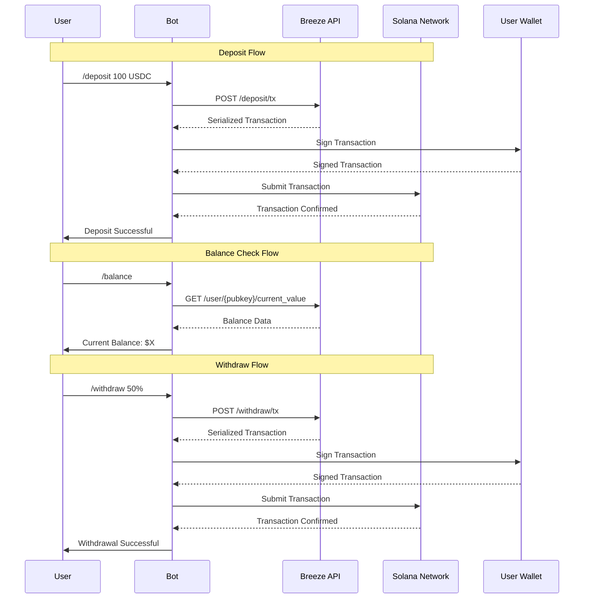

# Breeze Protocol Telegram Bot Integration Guide

This guide provides a comprehensive framework for integrating the Breeze Protocol into various types of Telegram bots, enabling users to earn yield on their stablecoins through conversational interfaces.

## Integration Overview

The Breeze Protocol integration transforms traditional Telegram bots into powerful DeFi interfaces, allowing users to:
- Deposit stablecoins into yield-generating funds
- Monitor real-time portfolio performance
- Execute withdrawals with simple commands
- Access detailed transaction history

<Info>
Breeze Protocol automatically handles user fund account creation, significantly simplifying the integration process for developers.
</Info>


## Integration Flow Diagram (very exact)




## Integration Patterns

### 1. Command-Based Integration

Perfect for bots with traditional command interfaces:

```typescript
class CommandBasedBreezeBot {
    private async handleDeposit(msg: Message, match: RegExpExecArray) {
        const amount = parseFloat(match[1]);
        const chatId = msg.chat.id;
        const userData = this.users.get(chatId)!;
        
        try {
            const tokenAmount = this.convertToTokenAmount(amount, 'USDC');
            
            const requestBody = {
                "params": {
                    "fund_id": BREEZE_FUND_ID,
                    "amount": Number(tokenAmount),
                    "all": false,
                    "user_key": userData.publicKey,
                    "payer_key": null
                }
            };

            const response = await fetch('https://api.breeze.baby/deposit/tx', {
                method: 'POST',
                headers: {
                    "Content-Type": "application/json",
                    "x-api-key": BREEZE_API_KEY
                },
                body: JSON.stringify(requestBody)
            });

            const data = await response.json() as BreezeApiResponse;
            
            if (data.success && data.result) {
                await this.processTransaction(chatId, data.result, 'deposit');
            }
        } catch (error) {
            await this.bot.sendMessage(chatId, `❌ Deposit failed: ${error.message}`);
        }
    }
}
```

### 2. Inline Keyboard Integration

For bots with rich interactive interfaces (current implementation):

```typescript
class InlineKeyboardBreezeBot {
    private async showYieldDashboard(chatId: number) {
        const userData = this.users.get(chatId)!;
        const publicKey = userData.publicKey!;
        
        const balance = await this.getUserCurrentValue(publicKey);
        const yieldData = await this.getBreezeYieldFromAPI(publicKey);
        
        const message = `
🌊 **Breeze Yield Dashboard**
💰 Current Balance: $${balance.toFixed(2)}
📈 APY: ${yieldData.toFixed(2)}%
        `;
        
        const keyboard = {
            inline_keyboard: [
                [
                    { text: '📥 Deposit', callback_data: 'deposit' },
                    { text: '📤 Withdraw', callback_data: 'withdraw' }
                ],
                [
                    { text: '💳 Detailed Balances', callback_data: 'view_balances' },
                    { text: '📈 Yield History', callback_data: 'view_yield_history' }
                ],
                [
                    { text: '⚙️ Settings', callback_data: 'settings_mock' },
                    { text: '❓ Help', callback_data: 'help_menu' }
                ]
            ]
        };
        
        await this.bot.sendMessage(chatId, message, {
            parse_mode: 'Markdown',
            reply_markup: keyboard
        });
    }
}
```

### 3. Conversational Flow Integration

For bots with natural language processing:

```typescript
class ConversationalBreezeBot {
    private async handleNaturalLanguage(msg: Message) {
        const text = msg.text?.toLowerCase();
        const chatId = msg.chat.id;
        
        if (text?.includes('deposit') || text?.includes('invest')) {
            await this.initiateDepositFlow(chatId);
        } else if (text?.includes('withdraw') || text?.includes('take out')) {
            await this.initiateWithdrawFlow(chatId);
        } else if (text?.includes('balance') || text?.includes('how much')) {
            await this.showBalance(chatId);
        }
    }
    
    private async initiateDepositFlow(chatId: number) {
        const userData = this.users.get(chatId)!;
        const balances = await this.getBalances(userData.publicKey!);
        
        await this.bot.sendMessage(chatId, 
            `I can help you deposit USDC to earn yield! 💰\n\n` +
            `Available: ${balances.usdc.human.toFixed(2)} USDC\n` +
            `Please tell me how much you'd like to deposit:`
        );
        
        userData.currentMenu = 'awaiting_deposit_amount';
    }
}
```

## Technical Implementation

### Core API Client

```typescript
export class BreezeAPIClient {
    private baseURL: string;
    private apiKey: string;
    
    constructor(baseURL: string, apiKey: string) {
        this.baseURL = baseURL;
        this.apiKey = apiKey;
    }
    
    async createDeposit(params: {
        fundId: string;
        amount: number;
        all: boolean;
        userKey: string;
        payerKey?: string;
    }): Promise<BreezeApiResponse> {
        const response = await fetch(`${this.baseURL}/deposit/tx`, {
            method: 'POST',
            headers: {
                'Content-Type': 'application/json',
                'x-api-key': this.apiKey
            },
            body: JSON.stringify({ params })
        });
        
        return await response.json();
    }
    
    async createWithdraw(params: {
        fundId: string;
        amount: number;
        all: boolean;
        userKey: string;
        payerKey?: string;
    }): Promise<BreezeApiResponse> {
        const response = await fetch(`${this.baseURL}/withdraw/tx`, {
            method: 'POST',
            headers: {
                'Content-Type': 'application/json',
                'x-api-key': this.apiKey
            },
            body: JSON.stringify({ params })
        });
        
        return await response.json();
    }
    
    async getUserBalances(userPubkey: string): Promise<BreezeUserBalancesResponse> {
        const response = await fetch(`${this.baseURL}/user-balances/${userPubkey}`, {
            method: 'GET',
            headers: {
                'Content-Type': 'application/json',
                'x-api-key': this.apiKey
            }
        });
        
        return await response.json();
    }
    
    async getUserYield(userPubkey: string, options?: {
        fundId?: string;
        page?: number;
        limit?: number;
    }): Promise<BreezeUserYieldResponse> {
        let url = `${this.baseURL}/user-yield/${userPubkey}`;
        const params = new URLSearchParams();
        
        if (options?.page) params.append('page', options.page.toString());
        if (options?.limit) params.append('limit', options.limit.toString());
        if (options?.fundId) params.append('fund_id', options.fundId);
        
        if (params.toString()) {
            url += `?${params.toString()}`;
        }
        
        const response = await fetch(url, {
            method: 'GET',
            headers: {
                'Content-Type': 'application/json',
                'x-api-key': this.apiKey
            }
        });
        
        return await response.json();
    }
}
```

### Transaction Management

```typescript
export class TransactionManager {
    private connection: Connection;
    
    constructor(rpcUrl: string) {
        this.connection = new Connection(rpcUrl);
    }
    
    async processTransaction(
        serializedTx: string,
        userKeypair: Keypair
    ): Promise<{ signature: string; success: boolean }> {
        try {
            const transaction = VersionedTransaction.deserialize(
                Buffer.from(serializedTx, 'base64')
            );
            
            // Sign transaction
            transaction.sign([userKeypair]);
            
            // Submit transaction
            const signature = await this.connection.sendTransaction(transaction);
            
            // Wait for confirmation
            const confirmation = await this.connection.confirmTransaction(
                signature,
                'confirmed'
            );
            
            if (confirmation.value.err) {
                throw new Error(`Transaction failed: ${confirmation.value.err}`);
            }
            
            return { signature, success: true };
            
        } catch (error) {
            console.error('Transaction processing error:', error);
            throw error;
        }
    }
}
```

### Message Formatting

```typescript
export class MessageFormatter {
    static formatBalance(balance: number, currency = 'USD'): string {
        return `💰 **Balance**: $${balance.toLocaleString('en-US', {
            minimumFractionDigits: 2,
            maximumFractionDigits: 2
        })}`;
    }
    
    static formatYield(apy: number): string {
        return `📈 **Current APY**: ${apy.toFixed(2)}%`;
    }
    
    static formatPortfolio(balances: BreezeUserBalancesResponse): string {
        let message = `🌊 **Portfolio Overview**\n\n`;
        message += `💰 **Total Value**: $${parseFloat(balances.total_portfolio_value).toFixed(2)}\n`;
        message += `🎯 **Total Yield**: $${parseFloat(balances.total_yield_earned).toFixed(2)}\n\n`;
        
        balances.balances.forEach(balance => {
            message += `• ${balance.symbol}: $${parseFloat(balance.total_balance).toFixed(2)}\n`;
        });
        
        return message;
    }
    
    static formatTransaction(type: string, amount: number, asset: string, signature: string): string {
        const icon = type === 'deposit' ? '📥' : '📤';
        const action = type === 'deposit' ? 'Deposited' : 'Withdrawn';
        
        return `${icon} **${action}**: ${amount.toFixed(2)} ${asset}\n` +
               `🔗 **Transaction**: \`${signature}\`\n` +
               `⏰ **Time**: ${new Date().toLocaleString()}`;
    }
}
```

## Best Practices

<AccordionGroup>
<Accordion title="Error Handling">
- Always check API response success status
- Provide user-friendly error messages
- Log errors with sufficient context for debugging
- Handle network timeouts and connection issues
</Accordion>

<Accordion title="User Experience">
- Show loading states during API calls with "⏳ Processing..." messages
- Implement transaction confirmation UI before signing
- Display clear success/failure messages with transaction links
- Use inline keyboards for intuitive navigation
</Accordion>

<Accordion title="Security">
- Store API keys securely in environment variables
- Never log private keys or sensitive information
- Validate all user inputs before processing
- Use HTTPS for all API communications
</Accordion>

<Accordion title="Performance">
- Cache user balance data appropriately
- Use efficient decimal handling with BigInt for token amounts
- Implement proper pagination for yield history
- Monitor API response times and implement timeouts
</Accordion>
</AccordionGroup>

## Conclusion

This integration guide demonstrates how to build production-ready Telegram bots using the Breeze API. The current implementation provides:

- **Real-time Data**: Live balance and yield information
- **User-friendly Interface**: Inline keyboards and conversational flows
- **Robust Transaction Handling**: Secure signing and submission
- **Comprehensive Analytics**: Portfolio tracking and yield history

Key takeaways:
- **Direct API Integration**: Simple REST API calls for all operations
- **Flexible Architecture**: Supports multiple interaction patterns
- **Production Ready**: Includes security and error handling
- **Extensible Design**: Easy to add new features

<Note>
Remember to test thoroughly in development before deploying to production. Monitor API usage and implement appropriate rate limiting for production deployments.
</Note>

For technical support and advanced integration scenarios, consult the official Breeze Protocol documentation or reach out to the development team.