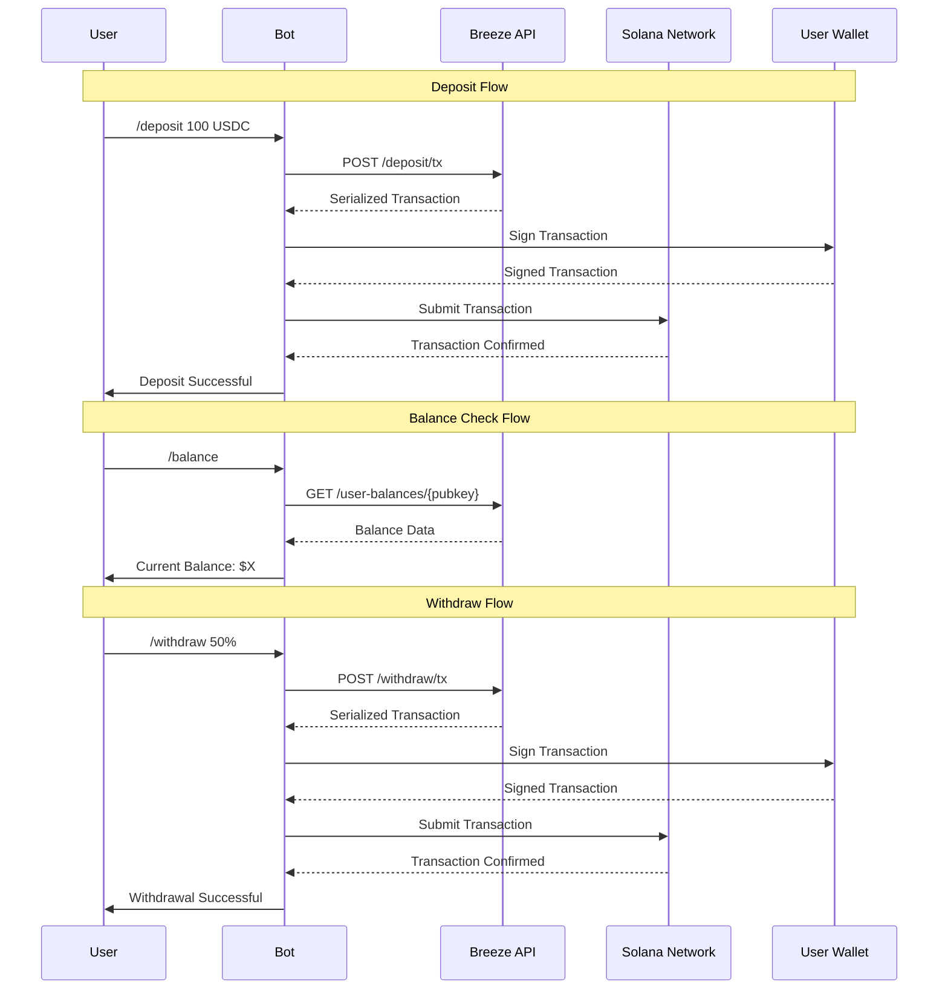

# Breeze Protocol Telegram Bot Integration Guide

This guide provides a comprehensive framework for integrating the Breeze Protocol into various types of Telegram bots, enabling users to earn yield on their stablecoins through conversational interfaces.

## Integration Overview

The Breeze Protocol integration transforms traditional Telegram bots into powerful DeFi interfaces, allowing users to:
- Deposit stablecoins into yield-generating funds
- Monitor real-time portfolio performance
- Execute withdrawals with simple commands
- Access detailed transaction history

<Info>
Breeze Protocol automatically handles user fund account creation, significantly simplifying the integration process for developers.
</Info>


## Integration Flow Diagram (very exact)



## Implementation Patterns

### 1. Command-Based Integration

Perfect for traditional command-driven bots:

```typescript
class CommandBasedBreezeBot {
    private breezeClient: BreezeAPIClient;
    private transactionManager: TransactionManager;
    
    constructor() {
        this.breezeClient = new BreezeAPIClient(
            process.env.BREEZE_API_URL!,
            process.env.BREEZE_API_KEY!
        );
        this.transactionManager = new TransactionManager(process.env.SOLANA_RPC_URL!);
    }
    
    private async handleDeposit(msg: Message, match: RegExpExecArray) {
        const amount = parseFloat(match[1]);
        const chatId = msg.chat.id;
        const userData = this.users.get(chatId)!;
        
        if (!userData.publicKey) {
            await this.bot.sendMessage(chatId, "❌ Please connect your wallet first using /connect");
            return;
        }
        
        try {
            // Show loading state
            await this.bot.sendMessage(chatId, "⏳ Preparing your deposit transaction...");
            
            const tokenAmount = this.convertToTokenAmount(amount, 'USDC');
            
            const depositParams = {
                fundId: process.env.BREEZE_FUND_ID!,
                amount: Number(tokenAmount),
                all: false,
                userKey: userData.publicKey,
                payerKey: null
            };

            const response = await this.breezeClient.createDeposit(depositParams);
            
            if (response.success && response.result) {
                const result = await this.transactionManager.processTransaction(
                    response.result,
                    userData.keypair
                );
                
                await this.bot.sendMessage(chatId, 
                    MessageFormatter.formatTransaction(
                        'deposit', 
                        amount, 
                        'USDC', 
                        result.signature
                    ),
                    { parse_mode: 'Markdown' }
                );
                
                // Show updated balance
                await this.showBalance(chatId);
            }
        } catch (error) {
            await this.bot.sendMessage(chatId, 
                `❌ Deposit failed: ${error instanceof Error ? error.message : 'Unknown error'}`
            );
        }
    }
    
    private async handleWithdraw(msg: Message, match: RegExpExecArray) {
        const input = match[1];
        const chatId = msg.chat.id;
        const userData = this.users.get(chatId)!;
        
        try {
            let amount: number;
            let withdrawAll = false;
            
            if (input.includes('%')) {
                const percentage = parseFloat(input.replace('%', ''));
                const balance = await this.getUserCurrentValue(userData.publicKey!);
                amount = balance * (percentage / 100);
            } else if (input.toLowerCase() === 'all') {
                withdrawAll = true;
                amount = 0; // Will be ignored when all=true
            } else {
                amount = parseFloat(input);
            }
            
            const withdrawParams = {
                fundId: process.env.BREEZE_FUND_ID!,
                amount: withdrawAll ? 0 : this.convertToTokenAmount(amount, 'USDC'),
                all: withdrawAll,
                userKey: userData.publicKey!,
                payerKey: null
            };
            
            const response = await this.breezeClient.createWithdraw(withdrawParams);
            
            if (response.success && response.result) {
                await this.processTransaction(chatId, response.result, 'withdraw');
            }
        } catch (error) {
            await this.bot.sendMessage(chatId, `❌ Withdrawal failed: ${error.message}`);
        }
    }
}
```

### 2. Interactive Keyboard Integration

For modern bots with rich user interfaces:

```typescript
class InteractiveBreezeBot {
    private async showDashboard(chatId: number) {
        const userData = this.users.get(chatId)!;
        
        if (!userData.publicKey) {
            await this.promptWalletConnection(chatId);
            return;
        }
        
        try {
            // Fetch all data in parallel
            const [balances, yieldHistory] = await Promise.all([
                this.breezeClient.getUserBalances(userData.publicKey),
                this.breezeClient.getUserYield(userData.publicKey, { limit: 1 })
            ]);
            
            const totalValue = parseFloat(balances.total_portfolio_value);
            const totalYield = parseFloat(balances.total_yield_earned);
            const currentAPY = yieldHistory.data?.[0]?.apy || 0;
            
            const message = `
🌊 **Breeze Protocol Dashboard**

💰 **Portfolio Value**: $${totalValue.toLocaleString('en-US', { minimumFractionDigits: 2 })}
📈 **Total Yield Earned**: $${totalYield.toLocaleString('en-US', { minimumFractionDigits: 2 })}
🎯 **Current APY**: ${currentAPY.toFixed(2)}%

📊 **Asset Breakdown**:
${balances.balances.map(b => 
    `• ${b.symbol}: ${parseFloat(b.total_balance).toFixed(2)} ($${parseFloat(b.usd_value).toFixed(2)})`
).join('\n')}
            `;
            
            const keyboard = {
                inline_keyboard: [
                    [
                        { text: '📥 Deposit', callback_data: 'action_deposit' },
                        { text: '📤 Withdraw', callback_data: 'action_withdraw' }
                    ],
                    [
                        { text: '📈 Yield History', callback_data: 'yield_history' },
                        { text: '🔄 Refresh', callback_data: 'dashboard_refresh' }
                    ],
                    [
                        { text: '⚙️ Settings', callback_data: 'settings_menu' },
                        { text: '❓ Help', callback_data: 'help_menu' }
                    ]
                ]
            };
            
            await this.bot.sendMessage(chatId, message, {
                parse_mode: 'Markdown',
                reply_markup: keyboard
            });
            
        } catch (error) {
            await this.bot.sendMessage(chatId, 
                `❌ Failed to load dashboard: ${error.message}`
            );
        }
    }
    
    private async handleCallbackQuery(query: CallbackQuery) {
        const chatId = query.message!.chat.id;
        const data = query.data!;
        
        // Answer callback to remove loading state
        await this.bot.answerCallbackQuery(query.id);
        
        switch (data) {
            case 'action_deposit':
                await this.initiateDepositFlow(chatId);
                break;
                
            case 'action_withdraw':
                await this.initiateWithdrawFlow(chatId);
                break;
                
            case 'yield_history':
                await this.showYieldHistory(chatId);
                break;
                
            case 'dashboard_refresh':
                await this.showDashboard(chatId);
                break;
                
            default:
                await this.bot.sendMessage(chatId, "❌ Unknown action");
        }
    }
    
    private async initiateDepositFlow(chatId: number) {
        const userData = this.users.get(chatId)!;
        const balances = await this.getWalletBalances(userData.publicKey!);
        
        const availableUSDC = balances.usdc?.human || 0;
        
        if (availableUSDC === 0) {
            await this.bot.sendMessage(chatId, 
                "❌ No USDC available in your wallet. Please add USDC to continue."
            );
            return;
        }
        
        const message = `
💰 **Deposit USDC to Breeze Protocol**

Available: ${availableUSDC.toFixed(2)} USDC
Current APY: ${await this.getCurrentAPY()}%

Please enter the amount you'd like to deposit:
• Type a number (e.g., 100)
• Type percentage (e.g., 50%)
• Type "all" for maximum deposit
        `;
        
        const keyboard = {
            inline_keyboard: [
                [
                    { text: '25%', callback_data: 'deposit_25' },
                    { text: '50%', callback_data: 'deposit_50' },
                    { text: '100%', callback_data: 'deposit_all' }
                ],
                [
                    { text: '❌ Cancel', callback_data: 'dashboard_refresh' }
                ]
            ]
        };
        
        await this.bot.sendMessage(chatId, message, {
            parse_mode: 'Markdown',
            reply_markup: keyboard
        });
        
        userData.currentMenu = 'awaiting_deposit_amount';
    }
}
```

### 3. Natural Language Processing Integration

For conversational AI-powered bots:

```typescript
class ConversationalBreezeBot {
    private async processNaturalLanguage(msg: Message) {
        const text = msg.text?.toLowerCase() || '';
        const chatId = msg.chat.id;
        const userData = this.users.get(chatId)!;
        
        // Intent detection
        const intents = {
            deposit: /\b(deposit|invest|add|put in|stake)\b/i,
            withdraw: /\b(withdraw|take out|remove|unstake|cash out)\b/i,
            balance: /\b(balance|how much|portfolio|holdings|total)\b/i,
            yield: /\b(yield|earnings|profit|apy|returns|earned)\b/i,
            help: /\b(help|how|what|tutorial|guide)\b/i
        };
        
        // Amount extraction
        const amountMatch = text.match(/(\d+(?:\.\d+)?)\s*(usdc|dollars?|\$)?/);
        const percentageMatch = text.match(/(\d+)%/);
        const allMatch = /\b(all|everything|maximum|max)\b/i.test(text);
        
        try {
            if (intents.deposit.test(text)) {
                if (amountMatch) {
                    const amount = parseFloat(amountMatch[1]);
                    await this.executeDeposit(chatId, amount);
                } else if (percentageMatch) {
                    const percentage = parseInt(percentageMatch[1]);
                    await this.executeDepositByPercentage(chatId, percentage);
                } else {
                    await this.initiateDepositFlow(chatId);
                }
            }
            
            else if (intents.withdraw.test(text)) {
                if (amountMatch) {
                    const amount = parseFloat(amountMatch[1]);
                    await this.executeWithdraw(chatId, amount);
                } else if (percentageMatch) {
                    const percentage = parseInt(percentageMatch[1]);
                    await this.executeWithdrawByPercentage(chatId, percentage);
                } else if (allMatch) {
                    await this.executeWithdraw(chatId, 0, true);
                } else {
                    await this.initiateWithdrawFlow(chatId);
                }
            }
            
            else if (intents.balance.test(text)) {
                await this.showDetailedBalance(chatId);
            }
            
            else if (intents.yield.test(text)) {
                await this.showYieldAnalytics(chatId);
            }
            
            else if (intents.help.test(text)) {
                await this.showContextualHelp(chatId, text);
            }
            
            else {
                await this.handleUnknownIntent(chatId, text);
            }
            
        } catch (error) {
            await this.bot.sendMessage(chatId, 
                `❌ I encountered an error: ${error.message}. Please try again or type "help" for assistance.`
            );
        }
    }
    
    private async executeDeposit(chatId: number, amount: number) {
        await this.bot.sendMessage(chatId, 
            `💰 I'll help you deposit ${amount} USDC into Breeze Protocol. Let me prepare the transaction...`
        );
        
        // Execute the actual deposit logic
        // ... (implementation similar to command-based approach)
    }
    
    private async showContextualHelp(chatId: number, originalText: string) {
        let helpMessage = "🤖 **Breeze Bot Help**\n\n";
        
        if (originalText.includes('deposit')) {
            helpMessage += "💰 **Depositing**:\n";
            helpMessage += "• Say: 'Deposit 100 USDC' or 'Invest 50% of my balance'\n";
            helpMessage += "• Use: /deposit [amount] command\n\n";
        }
        
        if (originalText.includes('withdraw')) {
            helpMessage += "📤 **Withdrawing**:\n";
            helpMessage += "• Say: 'Withdraw 50 USDC' or 'Take out 25%'\n";
            helpMessage += "• Use: /withdraw [amount] command\n\n";
        }
        
        helpMessage += "📊 **Common Commands**:\n";
        helpMessage += "• 'Show my balance' - View portfolio\n";
        helpMessage += "• 'How much have I earned?' - View yield\n";
        helpMessage += "• 'What's my APY?' - Current returns\n";
        
        await this.bot.sendMessage(chatId, helpMessage, { parse_mode: 'Markdown' });
    }
}
```

## Core API Implementation

### Breeze API Client

```typescript
export class BreezeAPIClient {
    private baseURL: string;
    private apiKey: string;
    private timeout: number;
    
    constructor(baseURL: string, apiKey: string, timeoutMs = 30000) {
        this.baseURL = baseURL;
        this.apiKey = apiKey;
        this.timeout = timeoutMs;
    }
    
    async createDeposit(params: {
        fundId: string;
        amount: number;
        all: boolean;
        userKey: string;
        payerKey?: string | null;
    }): Promise<BreezeApiResponse> {
        return this.makeRequest('/deposit/tx', 'POST', { params });
    }
    
    async createWithdraw(params: {
        fundId: string;
        amount: number;
        all: boolean;
        userKey: string;
        payerKey?: string | null;
    }): Promise<BreezeApiResponse> {
        return this.makeRequest('/withdraw/tx', 'POST', { params });
    }
    
    async getUserBalances(userPubkey: string): Promise<BreezeUserBalancesResponse> {
        return this.makeRequest(`/user-balances/${userPubkey}`, 'GET');
    }
    
    async getUserYield(userPubkey: string, options?: {
        fundId?: string;
        page?: number;
        limit?: number;
    }): Promise<BreezeUserYieldResponse> {
        let url = `/user-yield/${userPubkey}`;
        
        if (options) {
            const params = new URLSearchParams();
            if (options.page) params.append('page', options.page.toString());
            if (options.limit) params.append('limit', options.limit.toString());
            if (options.fundId) params.append('fund_id', options.fundId);
            
            if (params.toString()) {
                url += `?${params.toString()}`;
            }
        }
        
        return this.makeRequest(url, 'GET');
    }
    
    async getFundInfo(fundId: string): Promise<BreezeFundInfoResponse> {
        return this.makeRequest(`/fund/${fundId}`, 'GET');
    }
    
    private async makeRequest<T = any>(
        endpoint: string, 
        method: 'GET' | 'POST', 
        body?: any
    ): Promise<T> {
        const controller = new AbortController();
        const timeoutId = setTimeout(() => controller.abort(), this.timeout);
        
        try {
            const response = await fetch(`${this.baseURL}${endpoint}`, {
                method,
                headers: {
                    'Content-Type': 'application/json',
                    'x-api-key': this.apiKey
                },
                body: body ? JSON.stringify(body) : undefined,
                signal: controller.signal
            });
            
            if (!response.ok) {
                throw new Error(`API request failed: ${response.status} ${response.statusText}`);
            }
            
            return await response.json();
            
        } catch (error) {
            if (error.name === 'AbortError') {
                throw new Error('API request timeout');
            }
            throw error;
        } finally {
            clearTimeout(timeoutId);
        }
    }
}
```

### Enhanced Transaction Manager

```typescript
export class TransactionManager {
    private connection: Connection;
    private commitment: Commitment;
    
    constructor(rpcUrl: string, commitment: Commitment = 'confirmed') {
        this.connection = new Connection(rpcUrl, commitment);
        this.commitment = commitment;
    }
    
    async processTransaction(
        serializedTx: string,
        userKeypair: Keypair,
        options?: {
            skipPreflight?: boolean;
            maxRetries?: number;
        }
    ): Promise<{ signature: string; success: boolean; confirmationTime?: number }> {
        const startTime = Date.now();
        
        try {
            // Deserialize transaction
            const transaction = VersionedTransaction.deserialize(
                Buffer.from(serializedTx, 'base64')
            );
            
            // Sign transaction
            transaction.sign([userKeypair]);
            
            // Submit transaction with options
            const signature = await this.connection.sendTransaction(transaction, {
                skipPreflight: options?.skipPreflight || false,
                maxRetries: options?.maxRetries || 3
            });
            
            console.log(`Transaction submitted: ${signature}`);
            
            // Wait for confirmation with timeout
            const confirmation = await Promise.race([
                this.connection.confirmTransaction(signature, this.commitment),
                new Promise((_, reject) => 
                    setTimeout(() => reject(new Error('Transaction confirmation timeout')), 60000)
                )
            ]) as TransactionConfirmation;
            
            if (confirmation.value.err) {
                throw new Error(`Transaction failed: ${JSON.stringify(confirmation.value.err)}`);
            }
            
            const confirmationTime = Date.now() - startTime;
            console.log(`Transaction confirmed in ${confirmationTime}ms: ${signature}`);
            
            return { 
                signature, 
                success: true, 
                confirmationTime 
            };
            
        } catch (error) {
            console.error('Transaction processing error:', error);
            throw new Error(`Transaction failed: ${error instanceof Error ? error.message : 'Unknown error'}`);
        }
    }
    
    async getTransactionDetails(signature: string): Promise<any> {
        try {
            const transaction = await this.connection.getTransaction(signature, {
                commitment: 'confirmed',
                maxSupportedTransactionVersion: 0
            });
            
            return transaction;
        } catch (error) {
            console.error('Error fetching transaction details:', error);
            return null;
        }
    }
    
    async validateTransactionSignature(signature: string): Promise<boolean> {
        try {
            const status = await this.connection.getSignatureStatus(signature);
            return status.value !== null;
        } catch {
            return false;
        }
    }
}
```

### Enhanced Message Formatting

```typescript
export class MessageFormatter {
    static formatCurrency(amount: number, currency = 'USD', decimals = 2): string {
        return new Intl.NumberFormat('en-US', {
            style: 'currency',
            currency,
            minimumFractionDigits: decimals,
            maximumFractionDigits: decimals
        }).format(amount);
    }
    
    static formatPercentage(value: number, decimals = 2): string {
        return `${value.toFixed(decimals)}%`;
    }
    
    static formatBalance(balance: number, symbol = 'USD'): string {
        const formatted = this.formatCurrency(balance);
        return `💰 **Balance**: ${formatted}`;
    }
    
    static formatYield(apy: number, earned: number): string {
        return `📈 **APY**: ${this.formatPercentage(apy)} | **Earned**: ${this.formatCurrency(earned)}`;
    }
    
    static formatPortfolio(balances: BreezeUserBalancesResponse): string {
        const totalValue = parseFloat(balances.total_portfolio_value);
        const totalYield = parseFloat(balances.total_yield_earned);
        
        let message = `🌊 **Portfolio Overview**\n\n`;
        message += `💰 **Total Value**: ${this.formatCurrency(totalValue)}\n`;
        message += `🎯 **Total Yield**: ${this.formatCurrency(totalYield)}\n`;
        message += `📊 **Yield %**: ${this.formatPercentage((totalYield / totalValue) * 100)}\n\n`;
        
        message += `**Assets:**\n`;
        balances.balances.forEach(balance => {
            const amount = parseFloat(balance.total_balance);
            const usdValue = parseFloat(balance.usd_value);
            message += `• ${balance.symbol}: ${amount.toFixed(4)} ($${usdValue.toFixed(2)})\n`;
        });
        
        return message;
    }
    
    static formatTransaction(
        type: 'deposit' | 'withdraw', 
        amount: number, 
        asset: string, 
        signature: string,
        timestamp?: Date
    ): string {
        const icon = type === 'deposit' ? '📥' : '📤';
        const action = type === 'deposit' ? 'Deposited' : 'Withdrawn';
        const time = timestamp || new Date();
        
        return `${icon} **${action}**: ${this.formatCurrency(amount)} ${asset}\n` +
               `🔗 **Transaction**: \`${signature}\`\n` +
               `⏰ **Time**: ${time.toLocaleString('en-US', { 
                   timeZone: 'UTC',
                   year: 'numeric',
                   month: 'short',
                   day: 'numeric',
                   hour: '2-digit',
                   minute: '2-digit'
               })} UTC`;
    }
    
    static formatYieldHistory(yieldData: any[]): string {
        if (!yieldData.length) {
            return "📈 **Yield History**: No data available yet";
        }
        
        let message = "📈 **Recent Yield History**\n\n";
        
        yieldData.slice(0, 5).forEach((entry, index) => {
            const date = new Date(entry.timestamp).toLocaleDateString();
            const apy = parseFloat(entry.apy).toFixed(2);
            const earned = parseFloat(entry.yield_earned).toFixed(2);
            
            message += `${index + 1}. **${date}**: ${apy}% APY (+$${earned})\n`;
        });
        
        return message;
    }
    
    static formatError(error: string, context?: string): string {
        let message = `❌ **Error**`;
        if (context) message += ` (${context})`;
        message += `\n\n${error}`;
        
        message += `\n\n💡 **Tip**: Try again or contact support if the issue persists.`;
        return message;
    }
    
    static formatLoadingMessage(action: string): string {
        const loadingEmojis = ['⏳', '🔄', '⚡'];
        const emoji = loadingEmojis[Math.floor(Math.random() * loadingEmojis.length)];
        return `${emoji} ${action}...`;
    }
}
```

## Advanced Features

### Yield Analytics Dashboard

```typescript
class YieldAnalytics {
    static async generateYieldReport(
        breezeClient: BreezeAPIClient,
        userPubkey: string,
        days = 30
    ): Promise<string> {
        try {
            const yieldHistory = await breezeClient.getUserYield(userPubkey, {
                limit: days
            });
            
            if (!yieldHistory.data?.length) {
                return "📊 **Yield Report**: No yield data available yet. Start earning by making your first deposit!";
            }
            
            const data = yieldHistory.data;
            const totalEarned = data.reduce((sum, entry) => sum + parseFloat(entry.yield_earned), 0);
            const avgAPY = data.reduce((sum, entry) => sum + parseFloat(entry.apy), 0) / data.length;
            const bestDay = data.reduce((best, entry) => 
                parseFloat(entry.yield_earned) > parseFloat(best.yield_earned) ? entry : best
            );
            
            return `
📊 **${days}-Day Yield Report**

💰 **Total Earned**: ${MessageFormatter.formatCurrency(totalEarned)}
📈 **Average APY**: ${MessageFormatter.formatPercentage(avgAPY)}
🎯 **Best Day**: ${MessageFormatter.formatCurrency(parseFloat(bestDay.yield_earned))} (${new Date(bestDay.timestamp).toLocaleDateString()})
📅 **Active Days**: ${data.length}/${days}

**Performance Trend**: ${this.getTrendEmoji(data)}
            `;
            
        } catch (error) {
            return MessageFormatter.formatError("Failed to generate yield report", "Analytics");
        }
    }
    
    private static getTrendEmoji(data: any[]): string {
        if (data.length < 2) return "📊 Insufficient data";
        
        const recent = data.slice(0, 7).map(d => parseFloat(d.apy));
        const older = data.slice(7, 14).map(d => parseFloat(d.apy));
        
        const recentAvg = recent.reduce((a, b) => a + b, 0) / recent.length;
        const olderAvg = older.reduce((a, b) => a + b, 0) / older.length;
        
        if (recentAvg > olderAvg * 1.05) return "📈 Trending Up";
        if (recentAvg < olderAvg * 0.95) return "📉 Trending Down";
        return "➡️ Stable";
    }
}
```

## Best Practices & Production Considerations

<AccordionGroup>
<Accordion title="Error Handling & Resilience">
- **API Timeouts**: Implement proper timeout handling for all API calls
- **Rate Limiting**: Respect API rate limits and implement exponential backoff
- **Transaction Failures**: Provide clear error messages and retry mechanisms
- **Network Issues**: Handle temporary network failures gracefully

```typescript
class ErrorHandler {
    static async withRetry<T>(
        operation: () => Promise<T>,
        maxRetries = 3,
        baseDelay = 1000
    ): Promise<T> {
        for (let attempt = 1; attempt <= maxRetries; attempt++) {
            try {
                return await operation();
            } catch (error) {
                if (attempt === maxRetries) throw error;
                
                const delay = baseDelay * Math.pow(2, attempt - 1);
                await new Promise(resolve => setTimeout(resolve, delay));
            }
        }
        throw new Error('Max retries exceeded');
    }
}
```
</Accordion>

<Accordion title="User Experience Optimization">
- **Loading States**: Always show progress indicators during API calls
- **Transaction Confirmations**: Provide clear confirmation UI before signing
- **Success Feedback**: Display transaction hashes and success confirmations
- **Contextual Help**: Offer help based on user's current state

```typescript
class UXHelpers {
    static async showTransactionProgress(
        bot: TelegramBot,
        chatId: number,
        messageId: number,
        signature: string
    ) {
        const stages = [
            "⏳ Transaction submitted...",
            "🔄 Waiting for confirmation...",
            "✅ Transaction confirmed!",
        ];
        
        for (let i = 0; i < stages.length; i++) {
            await bot.editMessageText(stages[i], {
                chat_id: chatId,
                message_id: messageId
            });
            
            if (i < stages.length - 1) {
                await new Promise(resolve => setTimeout(resolve, 2000));
            }
        }
    }
}
```
</Accordion>

<Accordion title="Security Implementation">
- **Environment Variables**: Store all sensitive data in environment variables
- **Input Validation**: Sanitize and validate all user inputs
- **Private Key Security**: Never log or expose private keys
- **API Key Protection**: Rotate API keys regularly

```typescript
class SecurityUtils {
    static validateAmount(input: string): number {
        const amount = parseFloat(input);
        if (isNaN(amount) || amount <= 0 || amount > 1000000) {
            throw new Error("Invalid amount specified");
        }
        return amount;
    }
    
    static sanitizePublicKey(pubkey: string): string {
        // Remove any non-base58 characters
        return pubkey.replace(/[^1-9A-HJ-NP-Za-km-z]/g, '');
    }
}
```
</Accordion>

<Accordion title="Performance & Scalability">
- **Connection Pooling**: Reuse connections for API calls
- **Caching**: Cache user data and balance information appropriately
- **Batch Operations**: Group related operations when possible
- **Memory Management**: Properly clean up user sessions

```typescript
class PerformanceOptimizer {
    private static balanceCache = new Map<string, { data: any; timestamp: number }>();
    private static CACHE_TTL = 30000; // 30 seconds
    
    static async getCachedBalance(userPubkey: string, fetcher: () => Promise<any>) {
        const cached = this.balanceCache.get(userPubkey);
        const now = Date.now();
        
        if (cached && (now - cached.timestamp) < this.CACHE_TTL) {
            return cached.data;
        }
        
        const data = await fetcher();
        this.balanceCache.set(userPubkey, { data, timestamp: now });
        return data;
    }
}
```
</Accordion>
</AccordionGroup>

## Deployment & Monitoring

### Environment Configuration

```env
# Required Environment Variables
TELEGRAM_BOT_TOKEN=your_telegram_bot_token
BREEZE_API_URL=https://api.breeze.baby
BREEZE_API_KEY=your_breeze_api_key
BREEZE_FUND_ID=your_fund_id
SOLANA_RPC_URL=https://api.mainnet-beta.solana.com

# Optional Configuration
NODE_ENV=production
LOG_LEVEL=info
MAX_RETRIES=3
API_TIMEOUT=30000
CACHE_TTL=30000
```

### Health Monitoring

```typescript
class HealthMonitor {
    static async checkSystemHealth(): Promise<{
        status: 'healthy' | 'degraded' | 'unhealthy';
        services: Record<string, boolean>;
    }> {
        const services = {
            telegram: await this.checkTelegramAPI(),
            breeze: await this.checkBreezeAPI(),
            solana: await this.checkSolanaRPC()
        };
        
        const healthyCount = Object.values(services).filter(Boolean).length;
        const status = healthyCount === 3 ? 'healthy' : 
                      healthyCount >= 2 ? 'degraded' : 'unhealthy';
        
        return { status, services };
    }
}
```

## Conclusion

This comprehensive integration guide provides everything needed to build production-ready Telegram bots with Breeze Protocol integration. The implementation covers:

### Key Features Delivered
- **Multi-Pattern Integration**: Command-based, interactive keyboards, and conversational AI
- **Complete API Integration**: Full coverage of Breeze Protocol endpoints
- **Production-Ready Security**: Error handling, input validation, and secure key management
- **Rich User Experience**: Loading states, progress indicators, and intuitive interfaces
- **Advanced Analytics**: Yield tracking, portfolio insights, and performance monitoring

### Technical Highlights
- **Robust Transaction Processing**: Automatic retries, confirmation handling, and error recovery
- **Efficient Caching**: Smart balance caching to reduce API calls
- **Comprehensive Formatting**: Professional message formatting with currency and percentage handling
- **Scalable Architecture**: Clean separation of concerns for easy maintenance and extension

### Integration Benefits
- **Simplified User Onboarding**: Automatic fund account creation through Breeze Protocol
- **Real-Time Data**: Live balance updates and yield tracking
- **Flexible Interaction Models**: Supports multiple bot architectures and use cases
- **Enterprise-Ready**: Production monitoring, health checks, and performance optimization
