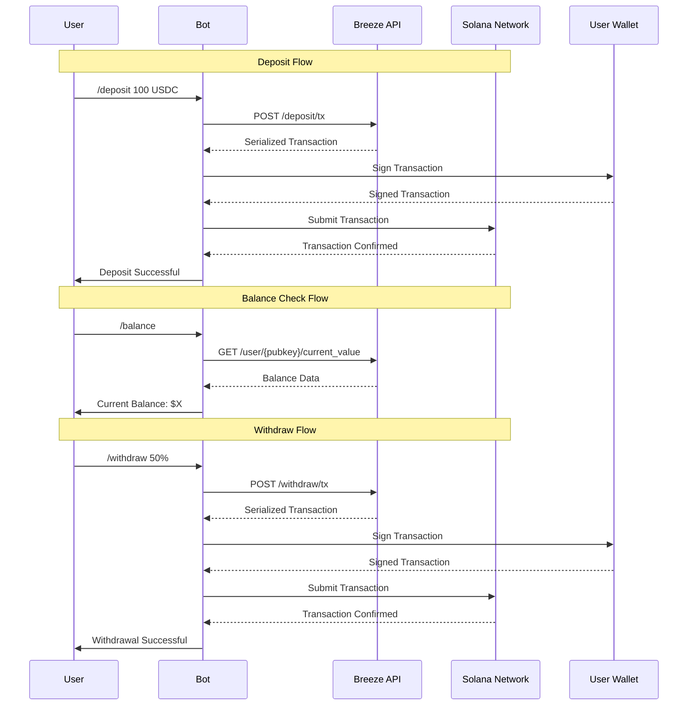
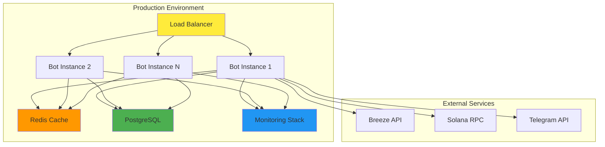

# Breeze Protocol Telegram Bot Integration Guide

This guide provides a comprehensive framework for integrating the Breeze Protocol into various types of Telegram bots, enabling users to earn yield on their stablecoins through conversational interfaces.

## Integration Overview

The Breeze Protocol integration transforms traditional Telegram bots into powerful DeFi interfaces, allowing users to:
- Deposit stablecoins into yield-generating funds
- Monitor real-time portfolio performance
- Execute withdrawals with simple commands
- Access detailed transaction history

<Info>
Breeze Protocol automatically handles user fund account creation, significantly simplifying the integration process for developers.
</Info>


## Integration Flow Diagram (very exact)



{/* ## Core Components Architecture

```mermaid
graph TB
    subgraph "Breeze Integration Module"
        A[API Client] --> B[Transaction Manager]
        B --> C[Balance Tracker]
        C --> D[Portfolio Monitor]
        
        E[Wallet Interface] --> F[Key Management]
        F --> G[Transaction Signer]
        
        H[Bot Interface] --> I[Command Handlers]
        I --> J[Message Formatters]
        J --> K[Keyboard Builders]
    end
    
    subgraph "External Dependencies"
        L[Breeze API]
        M[Solana RPC]
        N[Telegram Bot API]
    end
    
    A --> L
    B --> M
    H --> N
    
    style A fill:#fff3e0
    style E fill:#f1f8e9
    style H fill:#e3f2fd
``` */}

## Integration Patterns

### 1. Command-Based Integration

Perfect for bots with traditional command interfaces:

```typescript
class CommandBasedBreezeBot {
    private breezeClient: BreezeAPIClient;
    
    constructor() {
        this.breezeClient = new BreezeAPIClient({
            baseURL: process.env.BREEZE_API_URL,
            apiKey: process.env.BREEZE_API_KEY
        });
        
        this.setupCommands();
    }
    
    private setupCommands() {
        this.bot.onText(/\/deposit (.+)/, this.handleDeposit.bind(this));
        this.bot.onText(/\/withdraw (.+)/, this.handleWithdraw.bind(this));
        this.bot.onText(/\/balance/, this.handleBalance.bind(this));
        this.bot.onText(/\/yield/, this.handleYieldInfo.bind(this));
    }
    
    private async handleDeposit(msg: Message, match: RegExpExecArray) {
        const amount = parseFloat(match[1]);
        const chatId = msg.chat.id;
        
        try {
            const transaction = await this.breezeClient.createDeposit({
                userKey: this.getUserWallet(chatId).publicKey,
                amount: this.convertToTokenAmount(amount, 'USDC')
            });
            
            await this.processTransaction(chatId, transaction, 'deposit');
        } catch (error) {
            await this.bot.sendMessage(chatId, `❌ Deposit failed: ${error.message}`);
        }
    }
}
```

### 2. Inline Keyboard Integration

For bots with rich interactive interfaces:

```typescript
class InlineKeyboardBreezeBot {
    private async showYieldDashboard(chatId: number) {
        const userWallet = this.getUserWallet(chatId);
        const balance = await this.breezeClient.getUserValue(userWallet.publicKey);
        const yield = await this.breezeClient.getCurrentYield();
        
        const message = `
🌊 **Breeze Yield Dashboard**
💰 Current Balance: $${balance.toFixed(2)}
📈 APY: ${yield.toFixed(2)}%
        `;
        
        const keyboard = {
            inline_keyboard: [
                [
                    { text: '📥 Deposit', callback_data: 'deposit_menu' },
                    { text: '📤 Withdraw', callback_data: 'withdraw_menu' }
                ],
                [
                    { text: '📊 Portfolio', callback_data: 'portfolio_view' },
                    { text: '📈 Yield History', callback_data: 'yield_history' }
                ],
                [
                    { text: '⚙️ Settings', callback_data: 'settings_menu' },
                    { text: '❓ Help', callback_data: 'help_menu' }
                ]
            ]
        };
        
        await this.bot.sendMessage(chatId, message, {
            parse_mode: 'Markdown',
            reply_markup: keyboard
        });
    }
}
```

### 3. Conversational Flow Integration

For bots with natural language processing:

```typescript
class ConversationalBreezeBot {
    private async handleNaturalLanguage(msg: Message) {
        const text = msg.text?.toLowerCase();
        const chatId = msg.chat.id;
        
        if (text?.includes('deposit') || text?.includes('invest')) {
            await this.initiateDepositFlow(chatId);
        } else if (text?.includes('withdraw') || text?.includes('take out')) {
            await this.initiateWithdrawFlow(chatId);
        } else if (text?.includes('balance') || text?.includes('how much')) {
            await this.showBalance(chatId);
        }
    }
    
    private async initiateDepositFlow(chatId: number) {
        const balance = await this.getUserTokenBalance(chatId, 'USDC');
        
        await this.bot.sendMessage(chatId, 
            `I can help you deposit USDC to earn yield! 💰\n\n` +
            `Available: ${balance.toFixed(2)} USDC\n` +
            `Please tell me how much you'd like to deposit:`
        );
        
        this.setUserState(chatId, 'awaiting_deposit_amount');
    }
}
```

## Technical Implementation

### Core API Client

```typescript
export class BreezeAPIClient {
    private baseURL: string;
    private apiKey: string;
    private httpClient: AxiosInstance;
    
    constructor(config: BreezeConfig) {
        this.baseURL = config.baseURL;
        this.apiKey = config.apiKey;
        this.httpClient = axios.create({
            baseURL: this.baseURL,
            headers: {
                'Content-Type': 'application/json',
                'api-key': this.apiKey
            }
        });
    }
    
    async createDeposit(params: DepositParams): Promise<TransactionResponse> {
        const response = await this.httpClient.post('/deposit/tx', {
            params: {
                fund_id: params.fundId,
                amount: params.amount,
                all: params.all || false,
                user_key: params.userKey,
                payer_key: params.payerKey || null
            }
        });
        
        return this.validateResponse(response.data);
    }
    
    async createWithdraw(params: WithdrawParams): Promise<TransactionResponse> {
        const response = await this.httpClient.post('/withdraw/tx', {
            params: {
                fund_id: params.fundId,
                shares: params.shares,
                all: params.all || false,
                user_key: params.userKey,
                payer_key: params.payerKey || null
            }
        });
        
        return this.validateResponse(response.data);
    }
    
    async getUserValue(userPubkey: string): Promise<UserValueResponse> {
        const response = await this.httpClient.get(`/user/${userPubkey}/current_value`);
        return this.validateResponse(response.data);
    }
    
    private validateResponse(data: any): any {
        if (!data.success) {
            throw new Error(data.error || 'API request failed');
        }
        return data.result;
    }
}
```

### Transaction Management

```typescript
export class TransactionManager {
    private connection: Connection;
    private retryConfig: RetryConfig;
    
    constructor(rpcUrl: string, retryConfig?: RetryConfig) {
        this.connection = new Connection(rpcUrl);
        this.retryConfig = retryConfig || {
            maxRetries: 3,
            retryDelay: 1000,
            backoffMultiplier: 2
        };
    }
    
    async processTransaction(
        serializedTx: string,
        userKeypair: Keypair,
        options?: TransactionOptions
    ): Promise<TransactionResult> {
        const transaction = VersionedTransaction.deserialize(
            Buffer.from(serializedTx, 'base64')
        );
        
        // Sign transaction
        transaction.sign([userKeypair]);
        
        // Submit with retry logic
        return await this.submitWithRetry(transaction, options);
    }
    
    private async submitWithRetry(
        transaction: VersionedTransaction,
        options?: TransactionOptions
    ): Promise<TransactionResult> {
        let lastError: Error;
        
        for (let attempt = 0; attempt < this.retryConfig.maxRetries; attempt++) {
            try {
                const signature = await this.connection.sendTransaction(
                    transaction,
                    options?.sendOptions
                );
                
                const confirmation = await this.connection.confirmTransaction(
                    signature,
                    options?.confirmationStrategy || 'confirmed'
                );
                
                if (confirmation.value.err) {
                    throw new Error(`Transaction failed: ${confirmation.value.err}`);
                }
                
                return {
                    signature,
                    confirmation,
                    success: true
                };
                
            } catch (error) {
                lastError = error as Error;
                
                if (attempt < this.retryConfig.maxRetries - 1) {
                    await this.sleep(this.retryConfig.retryDelay * 
                        Math.pow(this.retryConfig.backoffMultiplier, attempt));
                }
            }
        }
        
        throw lastError!;
    }
    
    private sleep(ms: number): Promise<void> {
        return new Promise(resolve => setTimeout(resolve, ms));
    }
}
```

### Portfolio Monitoring

```typescript
export class PortfolioMonitor {
    private breezeClient: BreezeAPIClient;
    private updateInterval: number;
    private subscribers: Map<number, PortfolioSubscriber>;
    
    constructor(breezeClient: BreezeAPIClient, updateInterval = 30000) {
        this.breezeClient = breezeClient;
        this.updateInterval = updateInterval;
        this.subscribers = new Map();
    }
    
    subscribeToUpdates(chatId: number, subscriber: PortfolioSubscriber) {
        this.subscribers.set(chatId, subscriber);
        
        // Start monitoring if first subscriber
        if (this.subscribers.size === 1) {
            this.startMonitoring();
        }
    }
    
    private async startMonitoring() {
        while (this.subscribers.size > 0) {
            for (const [chatId, subscriber] of this.subscribers) {
                try {
                    const userWallet = subscriber.getUserWallet();
                    const currentValue = await this.breezeClient.getUserValue(userWallet.publicKey);
                    const previousValue = subscriber.getPreviousValue();
                    
                    if (this.hasSignificantChange(currentValue, previousValue)) {
                        await subscriber.onPortfolioUpdate({
                            chatId,
                            currentValue,
                            previousValue,
                            changePercent: this.calculateChangePercent(currentValue, previousValue)
                        });
                    }
                    
                    subscriber.setPreviousValue(currentValue);
                } catch (error) {
                    console.error(`Portfolio monitoring error for ${chatId}:`, error);
                }
            }
            
            await this.sleep(this.updateInterval);
        }
    }
    
    private hasSignificantChange(current: number, previous: number): boolean {
        if (!previous) return false;
        const changePercent = Math.abs((current - previous) / previous * 100);
        return changePercent >= 1.0; // 1% threshold
    }
    
    private calculateChangePercent(current: number, previous: number): number {
        if (!previous) return 0;
        return ((current - previous) / previous) * 100;
    }
}
```

## Bot Integration Patterns

### State Management

```typescript
interface UserState {
    chatId: number;
    currentMenu: string;
    wallet: {
        publicKey: string;
        privateKey: string; // Encrypted
    };
    portfolio: {
        totalValue: number;
        lastUpdate: Date;
        positions: Position[];
    };
    preferences: {
        notifications: boolean;
        language: string;
        currency: string;
    };
}

export class StateManager {
    private states: Map<number, UserState> = new Map();
    private storage: StorageAdapter;
    
    constructor(storage: StorageAdapter) {
        this.storage = storage;
    }
    
    async getUserState(chatId: number): Promise<UserState> {
        if (!this.states.has(chatId)) {
            const state = await this.storage.load(chatId);
            this.states.set(chatId, state || this.createDefaultState(chatId));
        }
        return this.states.get(chatId)!;
    }
    
    async updateUserState(chatId: number, updates: Partial<UserState>): Promise<void> {
        const currentState = await this.getUserState(chatId);
        const newState = { ...currentState, ...updates };
        
        this.states.set(chatId, newState);
        await this.storage.save(chatId, newState);
    }
}
```

### Message Formatting

```typescript
export class MessageFormatter {
    static formatBalance(balance: number, currency = 'USD'): string {
        return `💰 **Balance**: $${balance.toLocaleString('en-US', {
            minimumFractionDigits: 2,
            maximumFractionDigits: 2
        })}`;
    }
    
    static formatYield(apy: number): string {
        return `📈 **Current APY**: ${apy.toFixed(2)}%`;
    }
    
    static formatPortfolio(portfolio: Portfolio): string {
        const totalValue = portfolio.positions.reduce(
            (sum, pos) => sum + pos.value, 0
        );
        
        let message = `🌊 **Portfolio Overview**\n\n`;
        message += `💰 **Total Value**: $${totalValue.toFixed(2)}\n`;
        message += `📊 **Positions**: ${portfolio.positions.length}\n\n`;
        
        portfolio.positions.forEach(position => {
            message += `• ${position.asset}: $${position.value.toFixed(2)}\n`;
        });
        
        return message;
    }
    
    static formatTransaction(tx: Transaction): string {
        const icon = tx.type === 'deposit' ? '📥' : '📤';
        const action = tx.type === 'deposit' ? 'Deposited' : 'Withdrawn';
        
        return `${icon} **${action}**: $${tx.amount.toFixed(2)} ${tx.asset}\n` +
               `🔗 **Transaction**: \`${tx.signature}\`\n` +
               `⏰ **Time**: ${tx.timestamp.toLocaleString()}`;
    }
}
```

{/* ## Advanced Features

### Automated Yield Optimization

```typescript
export class YieldOptimizer {
    private breezeClient: BreezeAPIClient;
    private rebalanceThreshold: number;
    
    constructor(breezeClient: BreezeAPIClient, threshold = 0.5) {
        this.breezeClient = breezeClient;
        this.rebalanceThreshold = threshold;
    }
    
    async optimizePortfolio(userPubkey: string): Promise<OptimizationResult> {
        const currentPositions = await this.breezeClient.getUserValue(userPubkey);
        const availableStrategies = await this.getAvailableStrategies();
        
        const recommendations = this.calculateOptimalAllocation(
            currentPositions,
            availableStrategies
        );
        
        return {
            currentAllocation: currentPositions,
            recommendedAllocation: recommendations,
            potentialYieldIncrease: this.calculateYieldIncrease(
                currentPositions,
                recommendations
            )
        };
    }
    
    private async getAvailableStrategies(): Promise<YieldStrategy[]> {
        // Fetch available yield strategies from Breeze API
        return [];
    }
}
```

### Risk Management

```typescript
export class RiskManager {
    private maxPositionSize: number;
    private maxDailyVolume: number;
    private riskLimits: Map<string, number>;
    
    constructor(config: RiskConfig) {
        this.maxPositionSize = config.maxPositionSize;
        this.maxDailyVolume = config.maxDailyVolume;
        this.riskLimits = new Map(Object.entries(config.assetLimits));
    }
    
    async validateTransaction(
        userPubkey: string,
        transaction: TransactionRequest
    ): Promise<ValidationResult> {
        const currentPortfolio = await this.getCurrentPortfolio(userPubkey);
        const dailyVolume = await this.getDailyVolume(userPubkey);
        
        // Check position size limits
        if (transaction.amount > this.maxPositionSize) {
            return {
                valid: false,
                reason: `Transaction exceeds maximum position size of $${this.maxPositionSize}`
            };
        }
        
        // Check daily volume limits
        if (dailyVolume + transaction.amount > this.maxDailyVolume) {
            return {
                valid: false,
                reason: `Transaction would exceed daily volume limit of $${this.maxDailyVolume}`
            };
        }
        
        // Check asset-specific limits
        const assetLimit = this.riskLimits.get(transaction.asset);
        if (assetLimit && transaction.amount > assetLimit) {
            return {
                valid: false,
                reason: `Transaction exceeds ${transaction.asset} limit of $${assetLimit}`
            };
        }
        
        return { valid: true };
    }
}
``` */}
{/* 
## Deployment Architecture



## Security Considerations

### Private Key Management

```typescript
export class SecureWalletManager {
    private encryptionKey: string;
    private keyStorage: KeyStorageAdapter;
    
    constructor(encryptionKey: string, storage: KeyStorageAdapter) {
        this.encryptionKey = encryptionKey;
        this.keyStorage = storage;
    }
    
    async storeUserWallet(chatId: number, keypair: Keypair): Promise<void> {
        const encryptedKey = await this.encrypt(keypair.secretKey);
        await this.keyStorage.store(chatId, {
            publicKey: keypair.publicKey.toString(),
            encryptedPrivateKey: encryptedKey,
            createdAt: new Date()
        });
    }
    
    async getUserWallet(chatId: number): Promise<Keypair> {
        const walletData = await this.keyStorage.retrieve(chatId);
        if (!walletData) {
            throw new Error('Wallet not found');
        }
        
        const decryptedKey = await this.decrypt(walletData.encryptedPrivateKey);
        return Keypair.fromSecretKey(decryptedKey);
    }
    
    private async encrypt(data: Uint8Array): Promise<string> {
        // Implement secure encryption
        return '';
    }
    
    private async decrypt(encryptedData: string): Promise<Uint8Array> {
        // Implement secure decryption
        return new Uint8Array();
    }
}
```

## Testing Strategy

### Unit Tests

```typescript
describe('BreezeAPIClient', () => {
    let client: BreezeAPIClient;
    let mockAxios: jest.Mocked<AxiosInstance>;
    
    beforeEach(() => {
        mockAxios = {
            post: jest.fn(),
            get: jest.fn()
        } as any;
        
        client = new BreezeAPIClient({
            baseURL: 'http://test-api',
            apiKey: 'test-key'
        });
        
        (client as any).httpClient = mockAxios;
    });
    
    it('should create deposit transaction', async () => {
        const mockResponse = {
            data: {
                success: true,
                result: 'mock-serialized-tx'
            }
        };
        
        mockAxios.post.mockResolvedValue(mockResponse);
        
        const result = await client.createDeposit({
            fundId: 'test-fund',
            amount: 1000000,
            userKey: 'test-user-key'
        });
        
        expect(result).toBe('mock-serialized-tx');
        expect(mockAxios.post).toHaveBeenCalledWith('/deposit/tx', {
            params: {
                fund_id: 'test-fund',
                amount: 1000000,
                all: false,
                user_key: 'test-user-key',
                payer_key: null
            }
        });
    });
});
```

### Integration Tests

```typescript
describe('Bot Integration', () => {
    let bot: BreezeBot;
    let mockBreezeAPI: jest.Mocked<BreezeAPIClient>;
    
    beforeEach(() => {
        mockBreezeAPI = {
            createDeposit: jest.fn(),
            getUserValue: jest.fn()
        } as any;
        
        bot = new BreezeBot(mockBreezeAPI);
    });
    
    it('should handle deposit command', async () => {
        mockBreezeAPI.createDeposit.mockResolvedValue('mock-tx');
        
        const mockMessage = {
            chat: { id: 123 },
            text: '/deposit 100'
        };
        
        await bot.handleMessage(mockMessage as any);
        
        expect(mockBreezeAPI.createDeposit).toHaveBeenCalledWith({
            fundId: expect.any(String),
            amount: 100000000, // 100 USDC in token units
            userKey: expect.any(String)
        });
    });
});
``` */}

## Monitoring and Analytics

### Metrics Collection

```typescript
export class MetricsCollector {
    private prometheus: PrometheusRegistry;
    
    constructor() {
        this.prometheus = new PrometheusRegistry();
        this.initializeMetrics();
    }
    
    private initializeMetrics() {
        // API call metrics
        this.apiCallCounter = new Counter({
            name: 'breeze_api_calls_total',
            help: 'Total number of Breeze API calls',
            labelNames: ['endpoint', 'status']
        });
        
        // Transaction metrics
        this.transactionCounter = new Counter({
            name: 'breeze_transactions_total',
            help: 'Total number of transactions',
            labelNames: ['type', 'status']
        });
        
        // User metrics
        this.activeUsersGauge = new Gauge({
            name: 'breeze_active_users',
            help: 'Number of active users'
        });
    }
    
    recordAPICall(endpoint: string, status: string) {
        this.apiCallCounter.inc({ endpoint, status });
    }
    
    recordTransaction(type: string, status: string) {
        this.transactionCounter.inc({ type, status });
    }
    
    updateActiveUsers(count: number) {
        this.activeUsersGauge.set(count);
    }
}
```

## Best Practices

<AccordionGroup>
<Accordion title="Error Handling">
- Implement comprehensive error handling for API failures
- Provide user-friendly error messages
- Log errors with sufficient context for debugging
- Implement retry mechanisms for transient failures
</Accordion>

<Accordion title="User Experience">
- Provide clear feedback for all operations
- Show loading states during API calls
- Implement confirmation dialogs for destructive actions
- Support multiple languages if targeting global users
</Accordion>

<Accordion title="Security">
- Never log private keys or sensitive information
- Implement rate limiting to prevent abuse
- Use secure storage for user credentials
- Validate all user inputs
</Accordion>

<Accordion title="Performance">
- Implement caching for frequently accessed data
- Use connection pooling for database connections
- Optimize API calls by batching requests where possible
- Monitor response times and optimize bottlenecks
</Accordion>
</AccordionGroup>

## Conclusion

This comprehensive guide provides the foundation for integrating Breeze Protocol into various types of Telegram bots. The modular architecture allows for easy customization and extension based on specific bot requirements.

Key takeaways:
- **Simplified Integration**: Breeze handles user fund management automatically
- **Flexible Architecture**: Supports multiple bot interaction patterns
- **Production Ready**: Includes security, monitoring, and performance considerations
- **Extensible Design**: Easy to add new features and capabilities

<Note>
Remember to thoroughly test your integration in a development environment before deploying to production. Consider implementing gradual rollouts and monitoring user feedback during the initial launch phase.
</Note>

For technical support and advanced integration scenarios, consult the official Breeze Protocol documentation or reach out to the development team.